# Finviz Screener Agent — System Documentation

**Last updated:** 2026-04-12
**Repo:** https://github.com/AnanthSrinivasan/finviz-screener-agent  
**Live reports:** https://ananthsrinivasan.github.io/finviz-screener-agent/

---

## 1. What This System Is

An automated trading intelligence system built around Anantha's 2025 trading DNA.

Not a black-box signal generator. The system surfaces, scores, and ranks setups that match a **proven edge** — crypto/fintech + macro commodities + Stage 2 momentum — and gets out of the way for the human decision.

**Two parallel layers:**
- **Intelligence layer** — screener, weekly review, market monitor, alerts. Unchanged, always runs. Human reads and decides.
- **Paper execution layer** — autonomous Alpaca paper trading. Proves execution logic before touching real money. Real trades (Robinhood via SnapTrade) remain manual until paper P&L validates the approach.

**2025 performance that defines the edge:**
- 77% win rate on $1.2M traded, net +$54K
- 44% of profit from crypto/fintech (COIN +$13K, HOOD +$7K, SOFI +$2K)
- 30% from macro commodities (GLD +$8K, SLV +$8K before Feb 2026 loss)
- 17% from Stage 2 momentum (PLTR, IONQ, PL)
- Every single loss came from straying outside these three sectors

**The one rule that would have changed everything:**  
Stay in your sectors. The discipline gap costs ~$9K/year, not skills.

---

## 2. Architecture Diagram

```mermaid
flowchart TB
    subgraph GHA["GitHub Actions (scheduler)"]
        direction LR
        W1["daily-finviz.yml<br/><i>Mon-Fri 21:30 UTC</i>"]
        W2["weekly-finviz.yml<br/><i>Saturday 10:00 UTC</i>"]
        W3["earnings-alert.yml<br/><i>Mon-Fri 22:30 UTC</i>"]
        W4["position-book.yml + position-critical.yml<br/><i>book 13:15/14:30/17:30 UTC · critical */30 14-21 UTC</i>"]
        W5["market_monitor.yml<br/><i>Mon-Fri 22:00 UTC</i>"]
    end

    subgraph AGENTS["Python Agents"]
        direction LR
        A1["<b>finviz_agent.py</b><br/>5 screeners · Quality Score<br/>Stage analysis · VCP detection<br/>Sector badge · AI summary"]
        A2["<b>finviz_weekly_agent.py</b><br/>§1 Positioning & Book Risk<br/>§2 Week-Ahead Shortlist (trade-plan cards)<br/>§3 Book Weekend Review<br/>§4 Leadership Map · §5 Strategist's Note 🧠"]
        A3["<b>finviz_earnings_alert.py</b><br/>Quality &gt; 50 filter<br/>Sector filter<br/>7-day earnings window"]
        A4["<b>finviz_position_monitor.py</b><br/>$4,500 hard stop 🚨<br/>ATR exit system<br/>Peel levels"]
        A5["<b>finviz_market_monitor.py</b><br/>Alpaca 4pct breadth · F&amp;G<br/>7-state classification (COOLING new)<br/>State change alerts"]
    end

    W1 --> A1
    W2 --> A2
    W3 --> A3
    W4 --> A4
    W5 --> A5

    subgraph EXT["External Data Sources"]
        direction LR
        E1[("finviz.com<br/>screener + quote pages")]
        E2[("CoinGecko API<br/>CNN Fear &amp; Greed")]
        E3[("Anthropic API<br/><i>Claude Sonnet</i><br/>daily summaries<br/>web_search catalysts<br/>synthesised brief")]
        E4[("SnapTrade API<br/>Robinhood positions")]
        E5[("yfinance<br/>quarterly earnings<br/>revenue history")]
    end

    E1 -.-> A1
    E1 -.-> A2
    E1 -.-> A3
    E1 -.-> A5
    E2 -.-> A2
    E2 -.-> A5
    E3 -.-> A1
    E3 -.-> A2
    E3 -.-> A4
    E4 -.-> A4
    E5 -.-> A2

    subgraph OUT["Outputs"]
        direction LR
        O1["data/*.csv<br/><i>enriched daily screener<br/>weekly persistence scores</i>"]
        O2["data/*.html<br/><i>chart gallery<br/>weekly report + AI brief</i>"]
    end

    A1 --> O1
    A1 --> O2
    A2 --> O1
    A2 --> O2
    A5 --> O1

    O1 --> GP["GitHub Pages<br/>live reports index"]
    O2 --> GP

    subgraph SLACK["Slack Channels"]
        direction LR
        S1["<b>#daily-alerts</b><br/>quality picks + gallery"]
        S2["<b>#weekly-alerts</b><br/>top 5 + catalyst brief"]
        S3["<b>#general-alerts</b><br/>earnings · hard stops · breadth"]
        S4["<b>#positions</b><br/>ATR exits + P&amp;L"]
        S5["<b>#market-alerts</b><br/>state changes + THRUST"]
    end

    A1 ==> S1
    A2 ==> S2
    A3 ==> S3
    A4 ==> S4
    A5 ==> S5
    A5 ==> S6

    subgraph RISK["Risk Rules (hard-coded)"]
        direction LR
        R1["🚨 $4,500 hard stop<br/><i>per position max loss</i>"]
        R2["📊 ATR exit system<br/><i>+1x peel · -1x stop · -1.5x exit</i>"]
        R3["🔒 Sector discipline<br/><i>crypto/fintech · macro · stage 2</i>"]
    end

    style GHA fill:#e8eaf6,stroke:#9fa8da,color:#333
    style AGENTS fill:#e3f2fd,stroke:#1976d2,color:#333
    style EXT fill:#f5f5f5,stroke:#bbb,color:#333
    style OUT fill:#f3e5f5,stroke:#7b1fa2,color:#333
    style SLACK fill:#e8f5e9,stroke:#2e7d32,color:#333
    style RISK fill:#ffebee,stroke:#c62828,color:#333
    style GP fill:#f3e5f5,stroke:#7b1fa2,color:#333

    style A2 fill:#f3e5f5,stroke:#7b1fa2,color:#333
    style A3 fill:#fff8e1,stroke:#f57f17,color:#333
    style A4 fill:#e0f2f1,stroke:#00695c,color:#333
    style E3 fill:#fce4ec,stroke:#c62828,color:#333

    style R1 fill:#ffebee,stroke:#c62828,color:#b71c1c
    style R2 fill:#fbe9e7,stroke:#bf360c,color:#bf360c
    style R3 fill:#fff8e1,stroke:#f57f17,color:#e65100
```



---

## 3. Components

### 3.1 Daily Screener Agent — `finviz_agent.py`

**Schedule:** 21:30 UTC Mon-Fri (23:30 CET)  
**Slack:** `#daily-alerts` via `SLACK_WEBHOOK_DAILY`

**Flow:**
0. **Scrape canary** (`scrape_canary()`) — scrapes AAPL first and raises `ScrapeHealthError` if ATR% comes back None/0. Fails the whole run in one request if Finviz changed their page layout, instead of burning the full run and posting a misleading "0 passed".
1. Hits 5 Finviz screener URLs, aggregates all tickers
2. Fetches snapshot metrics (ATR%, EPS, SMA distances, Rel Volume, 52w high distance). **Parsing (2026-07-03):** reads ALL `<td class="snapshot-td2">` cells page-wide and pairs them key/value — Finviz moved these fields out of `<table class="snapshot-table2">` on ~2026-06-29. Post-scrape, `assert_scrape_healthy()` raises if the ENTIRE universe has ATR%=0 AND SMA50%=0 (the silent-break signature that rotted for 3 days). Both guards exit non-zero → `daily-finviz.yml` `if: failure()` → `#general-alerts` Slack alarm.
3. Computes Weinstein Stage Analysis
4. Computes Minervini VCP detection
5. Computes Quality Score
6. Generates sectioned chart gallery HTML
7. Calls Claude API for AI analyst summary
8. Re-saves enriched CSV (with ATR%, Quality Score) so earnings alert reads it correctly
9. Fires Slack to `#daily-alerts`

**7 Screeners:**

| Name | What it catches |
|------|----------------|
| 10% Change | Gap/surge moves — EP candidates (price floor $2, avg-vol 1M — 2026-05-30) |
| Growth | EPS 20%+, Sales 20%+, above all MAs (analyst-recom gate dropped 2026-06-09) |
| IPO | Mid-cap+, listed within 3 years, above 20-day |
| 52 Week High | Making new highs — price leadership |
| Week 20%+ Gain | Significant weekly moves — momentum |
| Power Move | 9M+ vol + 10%+ daily (institutional). Price floor $2, avg-vol 1M — 2026-05-30 |
| **Base / Near-High** | **Pre-breakout growth base (2026-06-09): Stage 2 + 0–10% below 52w high + EPS Q/Q & Sales Q/Q >20 — the DAVE-class the mover-screens miss** |

**Screener price/volume floors (2026-05-30):** `10% Change` + `Power Move` use
`sh_price_o2` + `sh_avgvol_o1000` (was `sh_price_o5` + `sh_avgvol_o500`). Price
floor dropped $5→$2 so sub-$5 movers at the base are visible (HYLN ~$2 on its
best 5/5 & 5/11 entries was filtered out by the old $5 floor, only appeared
5/13+ after +150%). Avg-vol raised 500k→1M as a penny-junk liquidity guard.

**Dollar-volume liquidity gate + Base/Near-High screen (2026-06-09 — DAVE-class):**
The 1M-*share* avg-vol floor was a crude share count that hid high-priced liquid
names. DAVE (Dave Inc — +311% EPS Y/Y, +104% Q/Q, +58% sales, Stage 2, −8% from
high) trades ~573K shares but ~$155M/day and was invisible to the *whole* system
(0 of last 30 screener CSVs; its 5/27 paper position came from a live SnapTrade
auto-detect, not the screener). Fixes: (1) quality screens (Growth/52WHigh/IPO/Base)
lowered to `sh_avgvol_o200`; (2) real liquidity enforced by
`passes_dollar_volume_gate()` (module-level in `finviz_agent.py`, unit-tested) —
drops a quality-screen name when avg **dollar** volume (`Avg Volume × Price`) <
**$30M/day**. **Mover screens (10% Change / Power Move / Week 20%+) are exempt** so
sub-$5 rockets (HYLN ~$2 × 1M = $2M/day) survive. Price is carried from the Finviz
screener table (`cols[9]`, index 9 in both v=111 and v=151 layouts) into
`summary_df['Price']`; the gate runs in `main()` after snapshot enrichment, before
scoring/CSV. The `an_recom_buybetter` analyst gate was also dropped from Growth
(was discarding ~4 under-covered quality growth names). The new **Base / Near-High**
screen flows into every downstream block (Ready-to-Enter, RS Leader, HTF-BR, 21 EMA
PB) since they all scan `summary_df`. Tests: `tests/test_dollar_volume_gate.py`.

**Dollar-volume PRE-filter (2026-06-09 perf fix):** the 200K share-vol floor doubled
the universe (133→254 rows, run 4–5min → 9m41s). Because the $30M gate above runs
*after* the per-ticker snapshot fetch (the slow part), it cleans output but doesn't
save scrape time. `passes_dollar_volume_prefilter()` runs in `main()` *before*
`fetch_snapshots_concurrent` using the screener table's own raw `Volume × Price`
(already scraped — no extra network), dropping obviously-illiquid names at a looser
**$20M** floor (`PREFILTER_MIN_DOLLAR_VOL`) so a single quiet-volume day can't drop
a real DAVE-class name. Movers exempt; the $30M avg gate stays as the final cut.
Tests: `tests/test_dollar_volume_gate.py::TestDollarVolumePrefilter`.

**Executor screener-CSV fallback (2026-06-09):** `alpaca_executor._resolve_screener_csv()`
falls back to the most recent `finviz_screeners_*.csv` with date ≤ today when today's
is absent (off-cycle / manual / late-`workflow_run` runs fire before the 20:30 UTC
screener — the 2026-06-05 00:07 UTC `no screener data` failure). Refuses data older
than `MAX_SCREENER_STALE_DAYS` (7) so it never trades on badly stale data. Tests:
`tests/test_alpaca_executor.py::ScreenerCsvFallbackTests`.

**DAVE → ARKF routing (2026-06-09):** `Credit Services` / `Financial - Credit
Services` → ARKF (fintech) in `INDUSTRY_TO_ETF` + explicit `DAVE → ARKF` override in
`ticker_sector_map.json` (DAVE's Finviz industry "Software - Application" was
mis-routing to IGV). Tests: `tests/test_sector_lookup.py`.

**🔥 Big Movers (top-of-Slack, 2026-05-30):** Power Move tickers passing the 9M+
share-volume post-filter (`_parse_vol`, since Finviz `sh_vol_o*` URL params are
silently ignored) are surfaced as a compact one-line block at the TOP of the
daily Slack message (above Ready-to-Enter), enriched with %change + volume and
sorted by volume desc — e.g. `🔥 Big Movers: *ONDS* (+83.1%, 248M)`. Prevents an
ONDS-class blow-off candle getting buried in the 200-row table. Replaces the
prior buried mid-message "Power Moves" line.

**Quality Score components:**
- Market cap (0–30 pts) — institutional grade filter
- Relative volume (0–25 pts) — conviction
- EPS Y/Y TTM (0–20 pts) — fundamental backing
- Multi-screener appearances (0–15 pts) — confirmation
- Stage 2 bonus (+25) / Stage 3 penalty (−25) / Stage 4 penalty (−40)
- VCP bonus (+15)
- Distance from 52w high (0–10 pts)

**Stage 2 criteria (fixed TAL-type false positives):**
- Price above SMA20, SMA50, SMA200
- SMA20 ≥ SMA50 (MAs properly stacked)
- Relative Volume ≥ 1.0 (not a sleepy drift)
- Distance from 52w high ≥ −25% (not still deep in base)

**Sector discipline badge:**  
Tickers outside core sectors get `⚠️ Outside Edge` and drop to Watch List.

---

### 3.2 Weekly Review Agent — `finviz_weekly_agent.py`

**Schedule:** 10:00 UTC Saturday  
**Slack:** `#weekly-alerts` via `SLACK_WEBHOOK_WEEKLY`

**Decision-first rebuild (Feature D, 2026-06-02).** The weekly was rear-view — it answered "what happened?" (which the daily does better) instead of "what do I do next week?". Rebuilt around the 4 jobs of a Saturday weekly for real capital. New section order in `generate_weekly_html` + `send_weekly_slack` + `main()`:

1. **§1 Positioning & Book Risk** (`agents/utils/weekly_positioning.py`) — opens with USER state: market_state + ETF rotation regime + "N positions vs cap M" (🚨 over cap via `effective_max_positions`). Realized P&L this week computed FIFO over `data/position_history.json` (real broker fills — the proven-correct source, NOT `trading_state.json`), W/L count, biggest winner/loser. Book health: green / underwater / past-stop-held + `$`-quantified leak for names held past stop. `build_positioning_summary` + `render_positioning_html`/`_slack` + `POSITIONING_CSS`. Tests: `tests/test_weekly_positioning.py` (11).
2. **§2 Week-Ahead Shortlist** (`agents/utils/week_ahead_shortlist.py`) — REPLACES the old Top 5. Forward funnel: entry-ready watchlist (status active) + emerging candidates + recent RS leaders (active/reacquired, last_active within 7d), deduped (entry-ready > emerging > rs-leader on ties), enriched with current screener metrics, gated Stage 2 + peel-safe (`_peel_warn_for`), ranked by Quality Score. Each name = full trade-plan card: **Setup · Trigger · Stop · Size · Invalidation**. Stop floor **−8%** (MAE-derived — see §MAE; `data/mae_analysis.json` 2024-25 winners' MAE median −4.8%, mean −10.5%), widened to 2×ATR% for volatile names. Size from regime (Full / Half / No-new-entries) with high-vol (>7% ATR) downgrade. Trigger keyed off SMA20% (reclaim 21 EMA on pullback / hold-and-add / wait-for-pullback when extended). `enrich_shortlist_notes_ai` adds optional terse setup/invalidation prose (single batched Claude call, non-fatal, deterministic fallback). Normalizes the serialized `compute_stage()` dict in the CSV `Stage` column via `_parse_stage`. Tests: `tests/test_week_ahead_shortlist.py` (27).
3. **§3 Book Weekend Review** (`agents/utils/book_weekend_review.py`) — per-open-position verdict (cur% / peak% / dist-to-stop / verdict) reusing `utils/generators/generate_live_portfolio.verdict_for` (the /pos-review ladder — single source of truth). Rows sorted action-first (cut → trim → trail → dead-weight → working). Optional Finviz technicals lookup feeds ext/stage annotations. Tests: `tests/test_book_weekend_review.py` (12).
4. **§4 Leadership Map** — ETF Sector Setup block (below) + promoted Emerging "Next on Radar" cards + macro / crypto / F&G snapshot.
5. **§5 Strategist's Note** — `generate_strategist_note` (replaces the old `generate_weekly_ai_brief` essay + `research_catalysts` web-search, both deleted). MAX 3 bullets — regime insight / best setup + why / the one risk — token-capped Claude call (max_tokens 350) with a deterministic data-driven fallback so it always renders.

**Removed:** the 🎯 Re-entry Setup 21 EMA pullback lane (`agents/utils/pullback_setup.py` + test deleted — was structurally empty ~90% of weeks; pullback detection folded into §2 via the Finviz SMA20% EMA proxy), the rear-view "Top 5 This Week" focus cards, and the per-top-3 catalyst web-search. The persistence/Signal-Score machinery (below) still computes — it now feeds the §4 Emerging cards and the demoted reference leaderboard, not the headline. Spec: [docs/specs/weekly-review-rebuild.md](docs/specs/weekly-review-rebuild.md).

**📊 Sector Setup This Week block (added 2026-05-17).** Weekly HTML and Slack render a sector setup block sourced from `data/etf_rotation.json` (Friday snapshot). After the Feature D rebuild it lives inside §4 Leadership Map. Helper module: `agents/utils/etf_rotation_summary.py` — pure functions `load_etf_rotation`, `summarize_etf_rotation`, `render_sector_setup_html`, `render_sector_setup_slack`, plus `REGIME_ADVICE` dict (regime tag → one-sentence "what this means for you this week") and `SECTOR_SETUP_CSS`. Top 5 ETFs per actionable bucket (BASE / PRE-BREAKOUT / EXTENDED / BROKEN); NEUTRAL filtered. Empty buckets omitted. Sort keys: BASE by ret20 desc, PRE-BREAKOUT by closest-to-highs, EXTENDED by mult50 desc, BROKEN by most-broken first. Falls through gracefully when `etf_rotation.json` is missing or invalid — weekly review still ships, just without the block. Tests: `tests/test_etf_rotation_summary.py` (15 unit tests). Spec: [docs/specs/weekly-etf-rotation-section.md](docs/specs/weekly-etf-rotation-section.md). Rationale: sector rotation moves on weeks, not days — weekly is the correct consumption cadence; daily dashboard remains for ad-hoc lookup.

**Unified Signal Score:**

```
Signal Score = Base Score + Signal Bonuses + Quality Modifier + Character Change

Base Score = (days_seen / total_days) × 100
           + (screener_diversity × 10)
           + 20 if multi-screener same day

Signal Bonuses:
  +35  CC    — character change confirmed (yfinance: 3+ qtrs improving EPS + sales accelerating)
  +30  EP    — gap/surge + 52w high + multi-screen same day
  +25  CC_WATCH — character change watch (EPS improving, sales need confirmation)
  +25  CHAR  — character change heuristic fallback (200d gain >50%, RVol >2.5x)
  +20  3+ screeners same day
  +15  IPO screener (lifecycle play)
  +10  52w high alone

Quality Modifier (from daily quality JSON):
  +30  Stage 2 + Q ≥ 60    (strong conviction)
  +15  Stage 2 + Q ≥ 40    (good)
  +10  Transitional + Q ≥ 60
    0  Transitional + Q ≥ 40
  −10  Stage 1              (basing)
  −20  Transitional + low Q / Stage 3
  −40  Stage 4              (downtrend — heavy penalty)
```

EP/IPO names compete in the same ranking as persistence leaders. A 3/7 day EP with score 123 ranks above a passive 7/7 single-screener name at 110. Badges explain *why* a name ranks where it does.

**🎯 Re-entry Setup — 21 EMA pullback lane — REMOVED (Feature D, 2026-06-02).** This block (`agents/utils/pullback_setup.py`) was deleted. It bucketed the ≤35-name recurring leaderboard by distance from the 21 EMA behind a 6-way AND (Q≥80 · RS≥60 · ATR ∈ [3,6] · dist [-12%,0] · peel-safe · within ±1.5% of 21 EMA on Fri close) → empty ~90% of weeks ("such a waste" — user). Pullback detection is folded into §2 Week-Ahead Shortlist via the Finviz SMA20% EMA proxy (no per-ticker Alpaca bar fetch).

**EP criteria (Stockbee/Qullamaggie):**
- Gap/surge screener fired: `10% Change` OR `Week 20%+ Gain`
- `52 Week High` also fired (real breakout, not dead-cat)
- `max_appearances ≥ 2` on same day

All three required. A single `10% Change` without a new high is not an EP.

**Character Change Detection (upgraded 2026-03-23):**

Three tiers — deep check takes priority, simple heuristic is the fallback:

**⚡ CC Confirmed (+35) — yfinance deep check on top 25 candidates:**
1. 3+ consecutive quarters of improving EPS (every quarter better than prior)
2. Sales growth accelerating last 2 quarters (both positive, latest > prior)
3. Price cleared 200-day MA within reasonable range (SMA200% between 0-60%)
4. Volume confirming (RVol ≥ 2.0)

**⚡ CC Watch (+25) — 3 of 4 conditions met:**
- EPS improving + MA cleared + volume confirming, but sales positive without accelerating

**🔄 CHAR Heuristic (+25) — fallback when yfinance data unavailable:**
- `SMA200%` > 50 (stock is 50%+ above 200-day MA)
- `Rel Volume` > 2.5x (institutional volume)
- `Week 20%+ Gain` screener fired

Deep check runs weekly via yfinance on the top 25 candidates. Daily agent shows `⚡ CC?` hint badge on cards where EPS > 0 + RVol ≥ 2.0 + Stage 2/high-momentum — confirmed in the weekly deep check.

**HTML report:** Dedicated "Character Change Alerts" section above leaderboard showing EPS trends, sales growth, and which conditions passed/failed.

**Signal merge — daily quality data drives weekly ranking:**
1. Daily agent writes `daily_quality_YYYY-MM-DD.json` with Q-rank, Weinstein stage, stage label, and chart grid section for every ticker
2. Weekly agent loads up to 7 days of quality JSONs; most recent day wins per ticker
3. Quality modifier adjusts signal score (Stage 2 + high Q = boost, Stage 4 = heavy penalty)
4. Watch List: tickers with `section == "watch"` are excluded from top 5 cards, Agent 2 research, Agent 3 brief, and Slack recommendations — but still shown in the full leaderboard with `[Watch]` tag

**Agent 2 — Catalyst Research:**
Top 3 actionable tickers (Watch List excluded) sent to Claude API with `web_search` tool. Each prompt includes Q-rank, stage, category (actionable vs watch), and CHAR flag. Finds real-world catalysts (earnings beats, analyst upgrades, sector tailwinds) explaining screener activity. Results stored as `{ticker: summary}`.

**Agent 3 — Synthesiser:**
Takes Agent 2 research + macro data + Fear & Greed + crypto data + **market monitor state** and generates the weekly AI brief. Quality rules enforced in prompt:
- Only Stage 2 or high-quality Transitional (Q > 60) recommended as Monday actionable
- Watch-only names get **one sentence max** — `[TICKER]: watch-only — [one reason].` No paragraph, no "why it ranks here."
- CC Confirmed names highlighted with fundamental turnaround context; CC Watch flagged with caveat
- Extended names flagged explicitly
- **Market state conditioning (structured output):**
  - RED/BLACKOUT → exactly 3 paragraphs: (1) state + exact re-entry trigger, (2) 1-2 first-in-queue names with specific entry levels, (3) macro one-liner. No per-ticker analysis for other names.
  - CAUTION → 4 paragraphs: state + GREEN trigger, 1-2 highest-conviction setups at half size, macro, Monday plan.
  - GREEN/THRUST → 4 paragraphs: backdrop, actionable names with catalyst + entry level, macro, Monday plan.

**Report structure:**
HTML body order (Feature D rebuild — decision-density first):
1. **§1 Positioning & Book Risk** (`render_positioning_html`) — regime / positions-vs-cap / realized-this-week / book health + leak callout
2. **§2 Week-Ahead Shortlist** (`render_shortlist_html`) — trade-plan cards (Setup · Trigger · Stop · Size · Invalidation); empty-state "Cash is a position"
3. **§3 Book Weekend Review** (`render_book_review_html`) — per-position verdict table, action-first sort
4. **§4 Leadership Map** — ETF Sector Setup (`render_sector_setup_html`) + **🔭 Next on the Radar** emerging cards (`select_emerging_candidates`: Stage 2 + Q≥70 + a fresh-catalyst signal EP/IPO/MULTI/CC_WATCH + SMA50% ≤ 20% extension guard; excludes held + current shortlist; emergence score Q + 20·CC_WATCH + 15·EP/IPO + 8·pre-breakout + 8·MULTI − 3·(days−1)) + macro / crypto / F&G snapshot
5. **§5 Strategist's Note** (`generate_strategist_note`) — 3 bullets (regime / best setup / the one risk)
6. *Reference (demoted to bottom):* ⚡ Character Change Alerts (EPS/sales/condition checklist) + Recurring-names leaderboard (score > 50% of max, cap 30; CSV + TradingView-list download buttons).

---

### 3.3 Winners Watchlist — `finviz_winners_watchlist.py` ✅ NEW

**Schedule:** 19:00 UTC Monday  
**Slack:** `#weekly-alerts` via `SLACK_WEBHOOK_WEEKLY`

Monitors 8 proven 2025 winners for re-entry setups. Also tracks 3 losers for character change.

**Winners watchlist:**

| Ticker | 2025 result | Edge |
|--------|------------|------|
| COIN | +$13,380 | crypto/fintech |
| HOOD | +$6,884 | crypto/fintech |
| SOFI | +$1,852 | crypto/fintech |
| PLTR | +$4,242 | stage2 momentum |
| IONQ | +$2,844 | stage2 momentum |
| GLD | +$8,214 | macro commodity |
| SLV | +$7,743 | macro commodity — Stage 2 only |
| PL | +$1,222 | ipo lifecycle |

**Three setup types:**
- `⚡ EP re-entry` — within 5% of 52w high + Stage 2 + RVol ≥ 1.2x
- `🟢 Stage 2 confirmed` — above all MAs, stacked, volume present
- `🔄 VCP forming` — ATR < 5%, RVol < 0.9x, above 20-day

**Lessons watchlist** (HIMS, RIVN, GME) — stage check only, not a trade signal.

**To add a new winner after a good trade:**
```python
"RDDT": {"reason": "2026 winner +$X, fintech", "edge": "crypto/fintech"},
```

---

### 3.4 Earnings Alert — `finviz_earnings_alert.py` ✅ UPDATED

**Schedule:** 22:30 UTC Mon-Fri (1 hour after screener)  
**Slack:** `#general-alerts` via `SLACK_WEBHOOK_ALERTS`

**Quality filter (item 4):**
- Only tickers with Quality Score > 50
- Only core sectors: crypto/fintech, macro, Stage 2 tech, energy, IPO lifecycle
- Character change flag: `10% Change` + `52 Week High` same week = potential Stage 1→2 transition

Reads enriched CSV written by the daily screener. Scrapes Finviz quote pages for earnings dates. Fires if any qualifying ticker has earnings within 7 days.

---

### 3.5 Alerts Agent — `finviz_alerts_agent.py`

**Schedule:** 22:00 UTC Mon-Fri  
**Slack:** `#general-alerts` via `SLACK_WEBHOOK_ALERTS`

F&G extremes, NYSE/Nasdaq breadth, ATR compression, commodity breakouts. State persisted in `data/alerts_state.json`.

---

### 3.6 Market Monitor — `finviz_market_monitor.py` ✅ NEW

**Schedule:** 22:00 UTC Mon-Fri
**Slack:** `#market-alerts` via `SLACK_WEBHOOK_MARKET_ALERTS` (state changes + THRUST only)

Standalone daily agent that classifies overall market conditions using Alpaca breadth data.

**Breadth source — Alpaca snapshots API (true 4%-filtered):**
- Universe: NYSE + NASDAQ active equities, price > $3, dollar vol > $250k OR volume > 100k (Bonde's filter)
- ~2,800 stocks after filters (universe logged daily as `universe_size`)
- THRUST = 500 stocks up 4%+ | DANGER = 500 stocks down 4%+ (Bonde "Very High pressure" calibration)

**Other daily fetches** (Finviz — may be blocked by GitHub Actions IP):
- Stocks up/down 25%+ in a quarter (supplemental only, zeroed when blocked)
- SPY price + SMA200% from Finviz quote page
- CNN Fear & Greed index

**Calculations:**
- Daily ratio: up_4 / down_4
- 5-day rolling ratio (sum of last 5 days' up / sum of last 5 days' down)
- 10-day rolling ratio
- Thrust detection: up_4 ≥ 500 (single-day breadth explosion)

**The state cycle flows directionally:**
```
RED → THRUST (signal) → CAUTION (building) → TREND-FOLLOW (steady uptrend, full size) ⇌ GREEN (thrust full bull)
    → COOLING (fading) → EXTENDED (parabolic, no chase) → DANGER (hard stop) → RED → BLACKOUT → RED ...

STEADY-UPTREND remains as a half-size safety net for tapes where the TREND-FOLLOW gates just miss.
```

COOLING and CAUTION are intentionally different states — same breadth readings, opposite action depending on whether you're going up or coming down from GREEN.

**Market state classification (priority order):**

| State | Condition | Direction | Action |
|-------|-----------|-----------|--------|
| BLACKOUT | Feb 1–end of Feb · Sep 1–Sep 30 | — | No new trades (seasonally unreliable months) |
| DANGER | 500+ stocks down 4%+ AND (5d ratio < 0.5 OR dn4 ≥ 3 × up4) | ↓ hard | Raise stops, no entries. v4 (May 2026) added the 3× single-day distribution path so a 535/110 catastrophic day fires DANGER even when 5d hasn't deteriorated yet. |
| **EXTENDED** | Trip: SPY ATR mult ≥ 7 OR SPY %above 50MA ≥ 8 OR QQQ ATR mult ≥ 9. v4 stickiness: once tripped, stay EXTENDED while SPY close ≥ 21 EMA AND > 50 SMA — the ATR-mult metric is NOT required during stay. Exits: 3 consecutive closes below 21 EMA → COOLING; any close below 50 SMA → RED. Re-entry from COOLING/CAUTION requires metric trip + new 20d close high. Re-entry from RED/DANGER/BLACKOUT is forbidden — must come up through CAUTION first. | ↑↑ blow-off | **No new entries** — parabolic tape, tighten stops, no chase. Overrides THRUST/GREEN/TREND-FOLLOW/CAUTION/STEADY. Trail counters persisted in `trading_state.json` as `extended_since_date` + `days_below_21ema`. |
| COOLING | prev_state==GREEN AND GREEN conditions no longer met | ↓ fading | Trim, tighten stops, no new entries |
| THRUST | 500+ stocks up 4%+ (Bonde "Very High" buying pressure) | ↑ signal | Build watchlist NOW |
| GREEN | 5d ratio ≥ 2.0, 10d ≥ 1.5, F&G ≥ 35, SPY above 200d MA | ↑ bull | Full size entries |
| **TREND-FOLLOW** | All 6 v3 gates (MA stack, slope, near 20d high, participation ≥ 8%, VIX calm, not EXTENDED) AND v4 (May 2026): prev_state ∉ {EXTENDED, RED, DANGER, BLACKOUT, COOLING} AND dn4 < 2 × up4. TREND-FOLLOW is a *continuation* path — must follow GREEN / THRUST / CAUTION / STEADY-UPTREND / TREND-FOLLOW itself. Out of EXTENDED runs through COOLING → CAUTION → GREEN/THRUST first. | ↑ steady trend | **Full size, entries allowed.** Rides steady grind-up tapes the v2 5d-ratio gate missed (Apr 24–May 5 2026 reference). v4 breadth-sanity gate rejects distribution days (e.g. 05-15: 110 vs 535). |
| CAUTION | 5d ratio ≥ 1.5, F&G ≥ 25, SPY above 200d MA | ↑ recovering | Half size, build watchlist |
| STEADY-UPTREND | SPY > 200d AND > 50d AND F&G ≥ 50 AND up4 ≥ dn4 AND 5d_ratio ≥ 0.9 AND prev_state ∉ {RED, DANGER, BLACKOUT, EXTENDED} AND not EXTENDED | ↑ steady | Half size — safety net when TREND-FOLLOW gates just miss (e.g. participation just under 8%). |
| RED | Everything else (SPY below 200d or weak breadth) | ↓ bear | No new trades |

**5d/10d breadth ratio demoted to thrust-strength gauge (v3, May 2026).** The 5- and 10-day up4/down4 ratios no longer gate any state. They are thrust detectors mis-used as trend detectors — steady grind-up tapes produce few 4% moves either way → ratio sits ~1.0 → falls through to RED. Slack now shows the 5d ratio as a gauge only; state decisions flow through the multi-factor TREND-FOLLOW gate.

**SPY/QQQ extension + trend metrics** (May 2026 + v3 additions): `fetch_index_extension()` in `agents/market/market_monitor.py` pulls SPY+QQQ daily bars from Alpaca and computes `spy_atr_mult_50`, `spy_sma50_pct`, `spy_sma50_slope_10d`, `spy_pct_from_20d_high`, `qqq_atr_mult_50`, `qqq_sma50_pct` using the same ATR% Multiple formula as `utils/calibrate_peel.py`. `is_extended()` fires if any of: SPY ATR mult ≥ 7, SPY %above 50 ≥ 8, QQQ ATR mult ≥ 9. `is_trend_follow()` requires all 6 gates above. VIX comes from `fetch_vix_snapshot()` (Yahoo `^VIX`). Participation proxy `pct_above_50ma` is computed as `up_25_quarter / universe_size` (shipped as v3 cheap path; true %above-50MA computation is a follow-up). Backtest replay: `python scripts/replay_state_machine.py --days 60`.

**STEADY-UPTREND prev_state guard** is strict: path out of RED stays RED → THRUST → CAUTION → GREEN. A single greedy-day bounce inside a downtrend cannot auto-rescue entries. Also blocked while EXTENDED is active (priority 3 wins).

**Confidence Layer (two overlays on top of base classification — May 2026):**

*Layer 1 — Post-THRUST floor:* After any THRUST day, minimum state = CAUTION for 3 calendar days. Prevents THRUST→RED the next day (Apr 30→May 1 regression). DANGER still bypasses the floor immediately. `post_thrust_floor_active: true` written to daily record and `trading_state.json`.

*Layer 2a — Extreme greed (F&G > 74):* When prev_state ∈ {GREEN, THRUST} and conditions deteriorate, the 2-day COOLING buffer (see below) is skipped — downgrade to RED fires immediately. `confidence_context: "extreme_greed_caution"` written to record. Slack appends `⚠️ EXTREME GREED ({fg})` to the state-change alert.

*Layer 2b — Extreme fear (F&G < 25) + THRUST:* When prev_state ∈ {RED, DANGER} and a THRUST day fires during extreme fear, override to CAUTION (not THRUST) with `confidence_context: "high_confidence_recovery"`. Capitulation + breadth explosion = bottom signal. Slack tags `⚡ HIGH-CONFIDENCE THRUST`.

*2-day COOLING buffer (normal F&G 25–74):* When prev_state==COOLING and conditions are RED-level (below CAUTION threshold), state stays COOLING for 1 extra day before allowing RED. Recovery to CAUTION is always immediate. Tracked via `consecutive_weak_days` in `trading_state.json` (reset to 0 on GREEN/THRUST/BLACKOUT).

**New fields in daily record:** `fg_regime` ("extreme_greed" | "extreme_fear" | "normal"), `post_thrust_floor_active` (bool), `confidence_context` (string | null), `spy_sma50_pct`, `spy_atr_mult_50`, `qqq_sma50_pct`, `qqq_atr_mult_50` (May 2026 — extension metrics).

**New fields in `trading_state.json`:** `consecutive_weak_days`, `last_extreme_greed_date`, `last_extreme_fear_date`.

**Data storage:**
- `data/market_monitor_YYYY-MM-DD.json` — daily snapshot
- `data/market_monitor_history.json` — rolling 30-day history (weekly agent reads this)

**Weekly agent integration:**
Agent 3 reads market state and conditions its recommendations. RED/BLACKOUT → watchlist framing only. CAUTION → half size. GREEN/THRUST → full size.

**Breadth source note:** `^NYADV ^NYDEC ^NAADV ^NADEC` yfinance symbols confirmed dead (April 2026). Alpaca snapshots API is the primary source and works reliably in GitHub Actions.

---

### 3.7 Publishing Layer — EventBridge + X Publisher ✅ NEW (2026-04-12)

**Event bus:** `finviz-events` (AWS EventBridge custom bus, `eu-central-1`, account `090960193599`)  
**Source:** `finviz.screener`  
**Publisher module:** `agents/publishing/event_publisher.py` (non-fatal wrapper)  
**Lambda:** `PublisherStack-XPublisher` — Python 3.11, reads X credentials from SSM at runtime

**Active tweets (2 per trading day):**

| Tweet | Event | Fired by | Time (ET) | Condition |
|-------|-------|----------|-----------|-----------|
| SetupOfDay | `ScreenerCompleted` | `premarket_alert.py` | 9:00am | Market not RED/BLACKOUT/DANGER |
| PersistencePick | `PersistencePick` | `finviz_agent.py` | ~4:30pm | `persistence_days >= 3` |

SetupOfDay reads yesterday's screener CSV (top Quality Score ticker, excluding open positions), fires at 9am ET with Alpaca pre-market price as the entry reference.

**SetupOfDay tweet template:**
```
Setup of the Day: $TICKER

Stage 2 confirmed ✓
VCP pattern ✓          ← only if vcp=True
Relative volume: Xx ✓
Quality score: XX/100

Entry zone: $XX.XX
Thesis breaks below $XX.XX (50MA)

XXX tickers in yesterday's screen.
Reply for the full PDF report.

Rules-based. Not advice.
```
Finviz daily chart attached as media.

**PersistencePick tweet template:**
```
🟢 GREEN | F&G: 58 | SPY above 200MA    ← state line when market_state is set

$TICKER has appeared in the screener
N days in a row this week.

Not a one-day spike.
Sustained presence = institutional interest building.

This is the pattern that preceded $FLY and $PL
before they made their moves.

Watching closely.
```
Finviz daily chart attached as media.

**MarketDailySummary event** — fired by `market_monitor.py` at ~5pm ET. XPublisher is a no-op (`return "skipped"`). Wired today so future subscribers (SlackPublisher, DiscordPublisher) can subscribe to the same bus without changing the market monitor.

**SSM credentials** (`/anva-trade/` namespace, SecureString):
- `X_API_KEY`, `X_API_SECRET`, `X_ACCESS_TOKEN`, `X_ACCESS_SECRET`
- Lambda reads via `ssm.get_parameters(WithDecryption=True)` — cached per container, never in env vars

**X API tier:** Pay-Per-Use (~$0.035/month for 66 tweets/month). Requires OAuth 1.0a with write permissions.

**Chart source:** `https://finviz.com/chart.ashx?t={ticker}&ty=c&ta=1&p=d` — downloaded by Lambda, uploaded to X Media API (`upload.twitter.com/1.1/media/upload.json`). Chart upload failure is non-fatal.

**TODOs:**
- Add `SlackPublisher` Lambda subscribing to `MarketDailySummary` (replace direct webhook calls)
- OIDC auth migration (`INFRA_AUTH_DESIGN.md` Option 3) for GitHub Actions → no static keys needed

---

### 3.8 Position Monitor — `agents/trading/position_monitor.py` ✅ UPDATED (May 2026 — Book / Critical split)

**Slack output now split into two streams** (replaces hourly per-event spam):

- **Position Book** (`position-book.yml`, env `BOOK_RUN=1`): runs **3x daily** at 13:15 / 14:30 / 17:30 UTC. Posts ONE consolidated table with TK / Avg / Now / Move% / Peak% / Stop / $P/L / STATE per row, plus an `🚨 ACTIONS TODAY` block (TRIM / ROUND-TRIP / STOP-NEAR / STOPPED rows sorted by severity) and an `📋 EVENTS SINCE LAST POST` digest.
- **Position Critical** (`position-critical.yml`): runs every 30 min 14:00–21:00 UTC. Posts ONLY when an event in `rules.CRITICAL_EVENT_KINDS` fires — `stop_hit`, `auto_closed`, `share_drift_avg_up`, `share_drift_partial_sell`, `target1`, `target2`, `hard_stop`. Each event = its own short Slack message. Same event also appended to `data/book_last_post.json` so the next book post acknowledges it.
- **Monitor Heartbeat** (`monitor-heartbeat.yml`, 2026-06-30): runs 4× during market hours (15/17/19/21 UTC). Checks via `gh run list` whether position-critical ran in last 120 min and position-book in last 240 min. Fires `🚨 MONITOR OFFLINE` Slack alert to `#positions` with manual dispatch link if either is stale. Catches GitHub Actions silent cron skips (Friday 6/27 incident — all monitors dropped, price crashed through stop with no alert).

State map (`agents/trading/book_table.py:compute_state`):

| State | Trigger |
|---|---|
| `🔻 STOPPED`    | stop_hit / auto_closed / hard_stop fired this run |
| `🚨 STOP NEAR`  | `abs(price − stop) / price < 0.5%` |
| `⚠ TRIM`        | peak ≥ 25% AND giveback > 10pp AND target1_hit (evaluated first — more specific than ROUND-TRIP) |
| `🚨 ROUND-TRIP` | peak ≥ 15% AND giveback > 18pp |
| `✓ HOLD`        | default |

`Slack:` `#positions` via `SLACK_WEBHOOK_POSITIONS`. New state file: `data/book_last_post.json` (`{last_book_post_ts, events_since_last: [...]}`). Cleared on every book post.

**ACTION column (May 2026 — `compute_action`):** every row in the book table now carries a short ("what to do") guidance string after STATE. Driven deterministically by state + target flags + peak-gain tier + ATR%, with context suffixes appended for `last_avg_up_date == today` ("no adds"), `entry_date == today` with peak < 20 and move ≥ 8 ("day-1 · no chase"), and `textbook_vcp` ("VCP ⭐"). Reads like the conversational guidance the user gets when asking "what should I do with X."

Examples: `trail tight · past T2` (T2 hit) · `T1 locked · runs to T2` (T1 hit) · `BE flag · ATR trail` (peak ≥ 20%) · `1.5×ATR trail tier` (peak ≥ 10%, ATR ≤ 8%) · `1.0×ATR trail · high-vol` (peak ≥ 10%, ATR > 8%) · `loss-cap floor on` (peak ≥ 5%) · `respect stop · weak` (negative move, peak < 5%) · `confirm exit, log result` (STOPPED) · `stop $X ≈ price — likely fires` (STOP_NEAR) · `cut half — round-trip` (ROUND-TRIP) · `trim — gave back from peak` (TRIM) · `day-1 · no chase` (entry today, move ≥ 8%).

**Events digest layout (May 2026 — `build_events_digest`):** events grouped into severity-ordered sections rather than a flat bullet list. Order: 🔻 Stops → ⚠ Warn / Peel → 🎯🎯 Target 2 → 🎯 Target 1 → 🟢 New positions → 🟡 Avg up → 🟠 Partial sell → 🪙 Breakeven / Trail / Fade → 🔄 Retro-patched → ℹ Other. Each event renders as one bullet — multi-line messages collapse newlines to ` · `, Slack `:emoji:` shortcodes and unicode emoji are stripped, ISO timestamps trim to `[HH:MM]`. Ticker prefix is suppressed when the message already names it. Classification uses `kind` first, falls back to `alert_type` (WARN_STOP / PEEL_WARN) and message regex (RETRO-PATCHED).

**Hard stop (item 3) — `MAX_POSITION_LOSS = -4500`:**

Fires 🚨 before any ATR calculation if a position is down more than $4,500 unrealised. Message says "Get out now. No exceptions." and references the SLV Feb 2026 loss explicitly.

```
SLV Feb 2026: held through Stage 3 distribution, lost $11K on one position.
$4,500 hard stop rule: no single position loses more than this. Period.
```

**Full alert hierarchy (priority order):**
1. 🚨 Hard stop — `pnl ≤ −$4,500`
2. 🔴 ATR exit — `atr_multiple_ma ≤ −1.5`
3. 🔴 Stop loss — `pnl% ≤ −dynamic_stop%`
4. 🟡 ATR warning — `atr_multiple_ma ≤ −1.0`
5. 🟡 Stop warning — approaching dynamic stop
6. ⚠️ MA trail exit signal — consecutive daily closes below regime EMA (see below)
7. 🟢 Peel signal — extended above MA (scales with ATR%)
8. 🔵 Peel warning — approaching peel level
9. ⚪ Healthy — no action

**ATR%-tiered, regime-adaptive MA trail rule** (post-close only, 22:00 UTC): For each open (`status=active`) position, fetches last 30 daily bars from Alpaca. Trail signal picked by **ATR%** first, then market regime:

| ATR% tier | Signal | Notes |
|---|---|---|
| ≤ 5% (low-vol) | Regime-adaptive EMA close-below | GREEN/THRUST → 2× below 21 EMA · CAUTION → 1× below 21 EMA · COOLING → 1× below 8 EMA |
| 5% < ATR% ≤ 8% (mid-vol) | 1× close below **8 EMA** | Mid-vol stocks — 21 EMA too generous |
| ATR% > 8% (high-vol) | Close below **10% trail from `highest_price_seen`** | High-vol runners (FLY/PL class) — MA can't keep up; uses dollar-floor instead |
| RED, DANGER, BLACKOUT | *skipped* — existing ATR stops tighter | — |

Why ATR%-tiered: high-ATR runners can give back 30%+ before MA catches up. FLY (ATR 11.2%, peak $46.30) → 10% trail floor $41.67 vs prior $35 stop-out. PL (ATR 9.5%, peak $41.70) → floor $37.54.

Non-exit: fires Slack alert ("⚠️ MA Trail Exit Signal"), stamps `ma_trail_alerted_date` on position entry for dedup, human decides. EMA computed client-side (iterative formula). Implemented as `rules.check_ma_trail_alert(closes, market_state, atr_pct, highest_price_seen)` in the shared engine `agents/trading/rules.py` — caller (`position_monitor.py` for live, `alpaca_monitor.py` for paper) fetches bars via `fetch_alpaca_daily_bars` and passes the close list. Tier picker `_ma_trail_signal_for_atr` is pure and unit-tested.

**Gain-protection stops (Rule 5 — shared `rules.apply_position_rules`):** Continuous ATR-tiered trail, ratchets off `highest_price_seen` (intraday-aware — fixes the VIK Apr-2026 regression where hourly snapshots missed the intraday peak even though `peak_gain_pct` recorded it). All triggers key off `peak_gain_pct`. Persisted state: `stop_price` (renamed from `stop` in Apr 29 2026 port) and `breakeven_activated` (renamed from `breakeven_stop_activated`; from Apr 30 2026 it is informational only — drives the Slack/dashboard `BE` indicator and acts as alert dedup; no longer gates the trail).

| Layer | Trigger | Action | Notes |
|---|---|---|---|
| Loss-cap floor | `peak_gain_pct ≥ 5` | `stop_price ≥ max(entry × 0.97, entry − 0.5×ATR$)` | Hybrid α/β. β tighter for low-vol (e.g. 3% ATR → -1.5% floor); α (-3%) caps high-vol (10% ATR → -3% not -5%). Plugs the "+8% peak fades to -5%" hole |
| ATR-tiered trail (silent) | `peak_gain_pct > 0` | `stop_price ≥ highest_price_seen − mult × ATR$` where mult = 2.0 if peak <10%, 1.5 if peak ≥10%, **1.25 if peak ≥20% AND atr_pct ≤ 5%, else 1.0** | Continuous, no freeze. Low-vol names get extra quarter-ATR breathing room at the lock tier (May 2026). CECO ref: stop $84.96 (1.25×) vs $86.03 (1.0×) |
| Breakeven crossover | `peak_gain_pct ≥ 20` (one-shot) | Sets `breakeven_activated=True`, fires `:lock:` Slack. Floor `stop_price ≥ entry × 1.005` applies as fallback when ATR data is missing | Informational. The 1.25/1.0×ATR trail is normally already above this floor by the time peak hits +20% |
| +30% floor | `peak_gain_pct ≥ 30` | `stop_price ≥ max(1.25/1.0×ATR trail, highest_price_seen × 0.90)` | The 10%-from-peak guard only wins for >10% ATR names where ATR trail is wider than 10%. Caps high-vol post-+30% give-back at 10% from peak |
| Fade alert | `peak_gain_pct ≥ 20` AND `current_price < highest_price_seen − 1×ATR` | Slack alert (5pp dedup) | Unchanged |

**Stop hit (Rule 1) — alert-only, no status mutation.** When `current_price <= stop_price`, the live caller fires a 🚨 STOP HIT Slack alert and a WARNING log line. Position `status` stays `"active"`. The user often holds through the alert; the system only signals — the human decides. **SMA5 filter (May 2026):** for low-ATR names (atr_pct ≤ 5%), if `current_price >= SMA(5 daily closes)`, the alert is suppressed for that run — the pullback hasn't broken the short-term trend. Implemented via `rules.price_above_sma5(closes, price)`. Paper monitor (`alpaca_monitor.py`) suppresses the actual sell order; live monitor (`position_monitor.py`) suppresses the STOP HIT alert. Both recheck next run. (The Apr 29 2026 port removed prior `status="stop_hit"` mutation and the now-dead `sync_snaptrade_with_rules` reset block. `data/positions.json` migrated once via `utils/migrate_positions_keys.py`.)

**Share-drift reconcile (ticker in both SnapTrade and `positions.json` with different share counts) — `sync_snaptrade_with_rules`:**

- **Avg-up** (SnapTrade > rules): trust SnapTrade's weighted `avg_cost`, set `entry_price = avg_cost`, recompute `target1`/`target2` (ATR-tiered — see below), reset `target1_hit` and `breakeven_activated` to False so the new levels apply afresh. `first_entry_price` is set on first avg-up and never overwritten thereafter. Slack alert "🟡 SHARES INCREASED".
- **Partial sell** (SnapTrade < rules): sync `shares` only; keep `entry_price`, `target1`, `target2`, `target1_hit`, `breakeven_activated` intact (still the same trade). Slack alert "🟡 PARTIAL SELL".
- 0.01-share tolerance for fractional rounding.

**Auto-close (positions in `positions.json` gone from SnapTrade) — `sync_snaptrade_with_rules`:**

Real exit price priority for `close_price`:
1. **SnapTrade SELL fill** — `fetch_recent_sell_fills(account_ids, days=14)` calls `/accounts/{id}/activities?type=SELL&startDate=…`, latest SELL by `trade_date` per ticker. `close_source = "snaptrade_fill"`.
2. **Alpaca last price** — `fetch_alpaca_last_price(ticker)` (latestTrade or prevDailyBar). `close_source = "live_quote"`.
3. **`highest_price_seen`** — last-resort fallback only. `close_source = "fallback_high"`.

**Price source architecture (2026-07-03):** `fetch_position_metrics` uses **Alpaca** (`fetch_alpaca_last_price`) as the primary price for all P&L / stop / alert calculations. Alpaca always returns last close even on holidays/pre-market — eliminates the price=0 bug class (bogus HARD STOP on holidays, -100% dashboard P&L). Finviz scrape provides only the technical fields (ATR, SMA50%, dist-from-high, RVol). If Finviz is rate-limited (429), alerts still fire correctly using Alpaca price; only technical-based signals (ATR exit, peel) degrade gracefully.

`close_source` persisted on closed position; Slack alert tags `(fill)`, `(quote)`, or `(peak — fill unavailable)`.

**Flat-book reconcile (2026-06-09 — AMZN ghost fix):** previously `main()` did
`exit(0)` the moment SnapTrade returned 0 holdings (`if not positions and not
has_trade_input`), which happened *before* the auto-close step — so any position
left in `positions.json` when the user went **fully flat** never closed and lingered
as a dashboard ghost (AMZN, shown owned while the live book was empty). Fix:
`fetch_positions()` records `LAST_SNAPTRADE_ACCOUNTS`; on a **confirmed**-flat book
(accounts reachable, 0 holdings) with lingering open positions, `main()` now runs
`sync_snaptrade_with_rules([], …)` to auto-close them, persists, Slack-alerts, and
regenerates the dashboards via the new `_regenerate_dashboards()` helper. **API-blip
guard:** only closes when accounts were actually reachable, so an unreachable-API
empty can never wipe the book on a false "flat." Test:
`test_position_monitor.py::test_fully_flat_closes_all_lingering_positions`.

**Recent events feed (`data/recent_events.json`):** rolling last 50 dashboard-surfaced events. Schema: `{updated, events: [{ts, date, category, title, severity, detail?}]}`. **Market events only** — categories: `market_state` (market_monitor) and other regime/breadth events. Position events (stop_hit, breakeven, target_hit, position_close) deliberately do NOT write here — they go to Slack only. The Apr 29 2026 port removed all position-event writes from `apply_minervini_rules` and the auto-close branch per spec. Helper `_append_recent_event` lives in `utils/events.py` (shared, DATA_DIR-aware); called only from `market_monitor.py` on state change. The dashboard "Recent Alerts" widget reads this file (newest 10) and falls back to legacy `alerts_state.last_alerts_sent` only if empty. Severity values: `low` (green), `med` (amber), `high` (red) → CSS left-border color.

Per-position transaction timeline is filtered to events at or after the position's `entry_date` AND a global system floor of `2026-04-01` — so prior trade cycles on the same ticker (e.g. an old FIGS round-trip on Mar 24/27 before the current 2026-04-24 entry) don't pollute the view.

**Position history cache (`data/position_history.json`):** every position-monitor run, `fetch_position_history(account_ids, days=90)` pulls all BUY+SELL activities, groups by ticker, and writes `{updated, history: {ticker: [{date, action, shares, price}]}}`. Paginated via `offset`/`limit=200` with cross-page dedup by activity id. **File must be in the `git add` list of `position-book.yml` and `position-critical.yml`** — was missing originally (May 2026), so the CI-written file was never pushed back. Locally it stayed frozen at the last manual commit while live SnapTrade SELL fills (AAOI/GLW) were being correctly fetched but discarded at workflow end. Dashboard $P/L walk had nothing to walk against. Fixed: both workflows now include `data/position_history.json` in commit. Used by the dashboard generator to render an expandable transaction timeline (chevron toggle) per open and closed position — shows avg-up, partial trim, full close events with running cost basis.

**Realized + unrealized $P/L walk — `compute_pnl_from_events(events, current_price, current_shares)`** in [utils/pnl_walk.py](utils/pnl_walk.py) — **shared source of truth**, do not duplicate. Walks BUY/SELL events ascending with weighted-avg cost basis; on SELL accrues `realized += sold * (price - avg_cost)`. Returns `{realized, unrealized, avg_cost, total_bought_units, total_sold_units, final_shares}`.

Consumers:
- **Dashboard ([utils/generators/generate_dashboard.py](utils/generators/generate_dashboard.py)):** open-position `$P/L` cell uses `realized + unrealized` when history has any prior SELL (falls back to `cost × gain_pct/100` when only the original BUY is present); closed-position expandable subrow appends a `Realized $: …` line.
- **Performance dashboard ([utils/generate_performance.py](utils/generate_performance.py)):** closed-trade ledger only. `load_snaptrade_partial_realized` walks `data/position_history.json`, splits each ticker's stream into **trade cycles** via `_split_into_cycles` (new cycle starts when running shares hit 0 then a BUY arrives — fixes FLY's 90d Mar round-trip + Apr-May cycle being walked as one 850/850 trade), and emits one row per FULLY-CLOSED cycle (`final_shares == 0`). Cost basis comes from `cost_basis_sold` (per-share avg at time of sale, accrued during the walk) — not `final_avg_cost × sold` which goes to 0 on fully-closed positions. `closed_positions` rows are dropped when (a) broker walk shows shares still open (rules engine sometimes records close prematurely — AAOI/GLW May 2026), or (b) date falls inside a SnapTrade cycle (walk supersedes synthesized FINAL-tranche row). Partial-trim realized P/L on still-open positions stays on the dashboard `$P/L` cell only.

**Retro-patch lagged fills — `retro_patch_closed_positions`:** runs every cycle. Iterates `closed_positions` where `close_source ∈ {fallback_high, user_reported_breakeven, live_quote}` AND `close_date` is within last 14 days. If SnapTrade `/activities` now returns a SELL fill for that ticker, rewrites `close_price`, `result_pct`, `close_source = snaptrade_fill_retro`. Adjusts `total_wins`/`total_losses` if result type flips (win ↔ loss ↔ neutral); leaves `consecutive_*` streaks alone (out-of-order history is messy). Slack alert: 🔄 RETRO-PATCHED CLOSE. Solves broker activity sync lag (24-48h common for after-hours trades). `live_quote` added Apr 30 2026 after NVDA/MU/CORZ/NBIS got stuck on Finviz quote estimates — was missing from the retry set so they never upgraded once the real fill landed.

**Neutral band:** `|result_pct| < 1.0%` → tagged BREAKEVEN. Does NOT touch `consecutive_wins`, `consecutive_losses`, `total_wins`, `total_losses`. `recent_trades.result = "neutral"`. Round-trip exits no longer phantom-pollute sizing-mode state.

---

## 4. Slack Channel Routing

| Secret | Channel | Content | Failure notifies |
|--------|---------|---------|-----------------|
| `SLACK_WEBHOOK_DAILY` | `#daily-alerts` | Daily screener picks + gallery | `#general-alerts` |
| `SLACK_WEBHOOK_WEEKLY` | `#weekly-alerts` | Weekly review + winners watchlist | `#general-alerts` |
| `SLACK_WEBHOOK_ALERTS` | `#general-alerts` | Earnings alerts + hard stop fires + breadth alerts | `#general-alerts` |
| `SLACK_WEBHOOK_POSITIONS` | `#positions` | Live P&L, ATR exits, peel levels | `#general-alerts` |
| `SLACK_WEBHOOK_MARKET_ALERTS` | `#market-alerts` | Market state changes + THRUST + confirmation alerts | `#market-alerts` |
| `SLACK_WEBHOOK_MOMENTUM` | `#momentum-alerts` | ⚡ Episodic Pivot SB fires (full cards) — Pradeep momentum lane | `#momentum-alerts` |

`#general-alerts` also receives all workflow failure notifications — single place to check if anything is broken.
`#market-alerts` stays quiet when market grinds in RED — only pings on meaningful state changes.

---

## 5. Sector Discipline

**Core edge sectors (where all 2025 profit came from):**
- Crypto / Fintech — COIN, HOOD, SOFI, PLTR, IONQ, RDDT
- Macro Commodities — GLD, SLV (Stage 2 only, hard stop mandatory)
- Stage 2 Momentum Tech — semiconductors, AI infrastructure, networking
- Energy — when XLE has macro tailwind
- IPO Lifecycle — mid-cap+, recently public, catalyst-driven

**Outside edge (where every 2025 loss came from):**
- Healthcare / Biotech (HIMS, CGON — unless IPO lifecycle with hard stop)
- EV / Automotive (RIVN)
- Meme stocks (GME)
- Macro crowded trades with blurry thesis (MSTR)
- Small-cap industrials without catalyst

---

## 5b. Sector Rotation Tracker (added 2026-05-08)

`agents/sector_rotation.py` runs daily at 21:15 UTC (15 min after market_monitor) and pulls daily Alpaca bars for a hand-curated ~33-ETF universe (sectors XLK/XLF/…/XLC + thematics SMH/XBI/GLD/SLV/REMX/XHB/JETS/… + benchmarks SPY/QQQ/IWM/DIA — see `data/sector_etf_map.json`).

For each ETF it computes:
- `ret_1d`, `ret_5d`, `ret_20d`
- `ret_vs_spy_5d`, `ret_vs_spy_20d`
- `rs_score` — 0–99 percentile rank of `ret_vs_spy_20d` within today's universe
- `rank` — sorted by rs_score (1 = best)
- `is_20d_rs_high` — today's `ret_vs_spy_20d` is the max in the trailing 20-day window for that ETF

History (`data/sector_rotation_history.json`, rolling 180 days) supplies:
- `rank_5d_ago`, `rank_delta_5d`
- `decay_streak_days` — consecutive worsening-rank days while `rs_score < 50`
- `anticipation_confirmed` — 20d-RS-high held for 2 consecutive days

Universe-level: `dispersion_1d_stdev` (stdev of 1d returns) percentile-ranked against 180d → drives `regime` (`correlation_phase` / `early-rotation` / `mid-rotation` / `late-rotation` / `blow-off-risk`).

**Slack roll-up** (Mon + Thu post-close, `#daily-alerts`): IN list (rank +10/RS≥70), OUT list (rank −10/RS<50, with decay annotation), Anticipation list (2-day-confirmed). Other weekdays write the snapshot and update history silently.

**History bootstrap guard.** When fewer than `MIN_HISTORY_DAYS_FOR_REGIME` (=20) prior dates exist in `sector_rotation_history.json`, `classify_regime()` short-circuits to `bootstrapping` (neutral action block: "Use market_state for sizing — ignore regime tag"). Prevents day-1 false positives where dispersion percentile collapses to 1.0 vs a 1-day sample. Seed history via the workflow `backfill=true` input (or `BACKFILL=true` env / `--backfill` CLI), which calls `backfill(days=60)` to replay daily snapshots from cached Alpaca bars.

**ETF Rotation Dashboard (added 2026-05-17).** Same workflow run also produces an HTML dashboard surfacing ETF-level setup state. New functions in `agents/sector_rotation.py`: `compute_etf_setup()` (per-ETF metrics: ATR%, mult50, dist52, range20, ret20, ema21d, RVol, MA stack), `assign_bucket()` (5-bucket classifier — `BASE` / `PRE-BREAKOUT` / `EXTENDED` / `BROKEN` / `NEUTRAL`), `compute_etf_setups()` (universe loop), `render_etf_rotation_html()` (light-theme one-page render), `write_etf_rotation_html/json()`. Outputs: `data/etf_rotation.html` (regime banner + cards grouped by bucket + full sortable metrics table) + `data/etf_rotation.json`. Wired into `main()` after the existing snapshot write — re-fetches the universe with `days=280` for SMA200 buffer (existing snapshot uses 210). Index tile: `📊 ETF Rotation` added to `utils/generators/generate_index.py`. ETF universe curated 35 → 28 → 37 → **45** (2026-05-29 v3 — second-pass audit after user asked "why are you restricting universe"): 11 sectors + 34 thematics. The 37→45 adds cover gaps identified by systematic review of every meaningful US-listed ETF: **PAVE** (US infrastructure / re-shoring — JBL/AMPX class previously routing to XLI lump), **IHI** (medical devices — ISRG/SYK/MDT class distinct from biotech), **DRIV** (autonomous & EV — Tesla/Rivian/Aptiv invisible to prior universe), **ICLN** (broad clean energy — wind/grid/storage that TAN-solar misses), **JETS** (airlines — un-dropped after recent rotation move proved the prior "low signal" reasoning stale), **URNM** (uranium pure-play — distinct from URA broad), **BLOK** (blockchain stocks — COIN/MARA/MSTR exposure distinct from IBIT bitcoin-price exposure), **EEM** (emerging markets ex-China — INDA/EWZ class invisible since KWEB is China-only). Earlier 28→37 adds (2026-05-29 v1): KWEB, ARKG, ARKF, REMX, WCLD, QTUM, IBIT, NLR — covered foreign-listed concentrations and basket-level themes. Universe is well above the prior 35-ETF "noisy percentile-rank" cap; user pushed back that the cap was hand-wavey and that "45 ETFs covering distinct themes is more valuable than 28 with gaps" — agreed. Mostly-redundant tickers explicitly NOT added (would dilute without new signal): SOXX (=SMH), CIBR/BUG (=HACK), BOTZ/ROBO/AIQ (=SMH+IGV), VIS/IYJ/FXR (=XLI), IBB (=XBI). Still-dropped from prior map: XSD, XHB, PBW, FAN, ROKT, PHO, XME, GLD, SLV, XRT. Saved-discipline: `feedback_proactive_theme_audit` in memory — when user asks any thematic question, re-run the audit before answering rather than going theme-by-theme. Spec: [docs/specs/etf-rotation-dashboard.md](docs/specs/etf-rotation-dashboard.md). Bucket thresholds: BASE = `s50 & s200 rising · mult50<3 · range20<12% · -10<dist52<-2`; PRE-BREAKOUT = `mult50<4 · -10≤dist52≤0`; EXTENDED = `mult50>5 OR dist52>-2`; BROKEN = `mult50<-1 OR NOT s200_rising`. Tests in `tests/test_etf_rotation_buckets.py`.

**RS Leaderboard + RS columns (added 2026-05-19).** Dashboard now merges per-ETF `rs_score` / `rank` / `rank_delta_5d` from the `sector_rotation_YYYY-MM-DD.json` snapshot into `etf_setups` before render (in `main()`). Adds: 🏆 RS Leaderboard section above the buckets (top 10 + bottom 5 by rs_rank with Δ5d colored — negative green = rank improving), color-coded RS chip on every bucket card (≥70 green · ≥50 blue · ≥30 amber · else red), and RS / Rank / Δ5d columns in the full metrics table. Stops forcing the human to read the JSON.

**⭐ Sweet Spot intersection card (2026-05-29 v3).** New top-of-dashboard section in `render_etf_rotation_html()` surfaces the actionable intersection without forcing the reader to manually cross-check ranking vs bucket. Filter: `rank ≤ 20 AND rank_delta_5d ≤ -3 AND bucket ∈ {BASE, PRE-BREAKOUT}` (high RS + climbing ≥3 spots over 5d + chart structure clean). Renders above the RS Leaderboard using the same `SHARED_HEADER` schema so the reader can compare directly. EXTENDED / BROKEN / NEUTRAL deliberately excluded — no clean entry. Rationale: with 45 ETFs the dashboard has two different lenses (rotation flow via ranking vs entry quality via bucket); the intersection is what's actionable. User asked "how do I review — by bucket or by ranking?" — answer is both, surface the AND.

**Plain-English `5d move` column (2026-05-29).** The leaderboard, full metrics table, per-ETF card RS chip, and SMH↔IGV pair banner all replaced the `Δrank ↓=better` jargon column with a plain-English movement display: `up N` (green) when rank climbed N spots over 5 trading days (rotating in), `down N` (red) when rank fell N spots (rotating out), `—` (gray) when no change. Single helper `_move_5d(delta)` drives all five render sites. No more sign-convention decoder ring. (`agents/utils/rotation_label.py` HOT/RISING/STABLE/FADING/COLD categorical emoji labels — introduced earlier same day for the Rotation Catalyst Slack block — were rejected for dashboard use: user couldn't differentiate HOT vs STABLE at a glance. They remain in use only for Slack `🌊 Rotation Catalyst` line headers where one ticker is being framed against one parent ETF.)

**Dashboard restructure (2026-05-20).** Dropped the per-bucket card sections (BASE/PRE-BREAKOUT/EXTENDED/BROKEN/NEUTRAL) — replaced by a one-line bucket-counts strip and a single click-sortable full table. Both the RS Leaderboard (top 10) and the full table now share one row schema: `Rank · Ticker · Name · RS · Δrank · ATR% · mult50 · dist52 · range20 · ret20 · EMA21 · RVol · 50/200 · Bucket`. Column headers are click-sortable (vanilla JS, numeric strip). Default order = bucket-grouped (BASE→PRE-BREAKOUT→EXTENDED→BROKEN→NEUTRAL). Δ5d header relabelled to `Δrank ↓=better` with explainer subtitle. Amber row tint for RS 60–80 (Qullamaggie momentum-sweet-spot band). New SMH↔IGV pair status line — always renders (gray "⚖️ stable" when neutral, amber/blue 🔄 "possible rotation" banner when one of the pair shifts by ≥3 ranks while the other moves the opposite way ≥3 ranks). Phrased as "possible rotation" not "money flow" (we observe relative strength, not flow). The always-on form avoids hunting through the table to check the most-asked pair. Sector universe gained FDN (Internet Content) so the `INDUSTRY_TO_ETF` router's FDN mapping has a corresponding ETF on the dashboard. `sector-rotation.yml` `git add` extended to include `data/etf_rotation.html` and `data/etf_rotation.json` — prior version was regenerating both but never committing, so GitHub Pages served a stale dashboard.

**Stage Transition 200 SMA gate loosened (2026-05-20).** `_is_stage_transition` 200 SMA gate widened `-5 → -15`. Original threshold was killing the early-cycle software reclaim it was designed to catch — CRWD/SNOW/HUBS class names with price above 50 SMA + 8/21 EMA but 200 SMA still 10-15% above. Sector-rank gate (`rank_delta_5d ≤ -5`) carries the false-positive risk.

**Regime → action map (Phase 1, 2026-05-08).** Each regime tag maps to a Slack action block (headline + 3 bullets: sizing / entries / held) injected beneath the phase line. Lives in `REGIME_ACTIONS` dict in `agents/sector_rotation.py`; `regime_action(regime)` helper returns the dict or None for unknown tags. Phase 1 is informational only — no mutation of paper executor or position monitor logic. Phase 2 (deferred, gated on 4 weeks of validation) will wire `blow-off-risk` to block entries, `late-rotation` to halve `size_mul`, and add regime-transition alerts.

| Regime | Headline | Sizing posture | Entry posture | Held positions |
|---|---|---|---|---|
| `bootstrapping` | Regime bootstrapping — insufficient history | Use market_state — ignore regime | Trust the screener; sector signal not yet calibrated | Manage by existing rules |
| `correlation_phase` | Beta tape — no sector edge | Size down — beta tape | Trade SPY/QQQ if anything | Hold, no adds |
| `early-rotation` | Leadership forming | Normal sizing | Build watchlist, wait 5d confirm | Hold |
| `mid-rotation` | Best entry tape | Full size GREEN/THRUST · half CAUTION | Press confirmed RS leaders | Add to leaders, hold others |
| `late-rotation` | Leadership narrowing | Reduce new-entry size 50% | Fresh RS-rising leaders only; skip extended | Trim ≥+25% from entry; no adds |
| `blow-off-risk` | Risk-off | No new entries | Skip all entries | Tighten stops · trim aggressively · cash is a position |

**Held-ticker → ETF lookup** lives in `agents/utils/sector_lookup.py`. Three-tier resolution: (1) explicit `data/ticker_sector_map.json` override (kept for edge cases like AAOI where industry says "Communication Equipment" but revenue mix is semis-adjacent → SMH); (2) `INDUSTRY_TO_ETF` substring match on Finviz Industry — semis→SMH, software (Application/Infrastructure)→IGV, internet content→FDN, banks→KBE, capital markets→KCE, insurance→KIE, biotech/drug manufacturers→XBI, residential construction/building products→XHB; (3) Finviz-Sector fallback. Industry routing (May 2026) fixed the "Technology" lump where SMH semis and IGV software both resolved to XLK and the May 2026 software rotation was invisible. Also used by the new 🌱 Stage Transition screener block (see §Daily Screener Signals).

The `sector-rotation.yml` cron was moved 21:15 → 20:15 UTC so the daily screener (20:30 UTC) can read today's `data/sector_rotation_YYYY-MM-DD.json` snapshot for the Stage Transition `rank_delta_5d` gate.

---

## 6. Data Storage

**Flat files only — no database needed.**

```
data/
  finviz_screeners_YYYY-MM-DD.csv          # enriched daily (ATR%, Quality Score, Stage, VCP)
  finviz_screeners_YYYY-MM-DD.html         # plain HTML table
  finviz_chart_grid_YYYY-MM-DD.html        # chart gallery (sector rotation + Rotating In + click-filter)
  daily_quality_YYYY-MM-DD.json            # Q-rank, stage, section — feeds weekly signal merge
  finviz_weekly_YYYY-MM-DD.html            # weekly report
  finviz_weekly_persistence_YYYY-MM-DD.csv # weekly signal scores (incl. quality mod, CHAR flag)
  alerts_state.json                        # breadth/F&G alert state
  market_monitor_YYYY-MM-DD.json           # daily market breadth snapshot
  market_monitor_history.json              # rolling 30-day history (weekly agent reads this)
  positions_YYYY-MM-DD.json                # real Robinhood position snapshots (via SnapTrade)
  watchlist.json                           # market pulse watchlist — manual entries + auto-populated by screener
  paper_stops.json                         # paper state {ticker: {stop_price, entry_price, atr_pct, entry_date, highest_price_seen, peak_gain_pct, breakeven_activated, target1, target2, target1_hit, pending_close}}
  paper_trading_state.json                 # paper streaks/sizing — independent from live trading_state.json (consecutive_wins/losses, current_sizing_mode, recent_trades). Drives executor's size_mul + suspended block.
```

Volume is ~100–200 tickers/day. GitHub Actions reads/writes CSV natively. Reports are static HTML on GitHub Pages. No server, no cost, fully auditable via git history.

### Chart gallery sector rotation panel

Top of `finviz_chart_grid_YYYY-MM-DD.html`:

- **Volume × Quality** (8 cards) — ranked by `count × avg_q × (1 + stage2_ratio × 0.5)` (`compute_sector_rotation`). Rank 1 gets the "Leading" badge — this is the crowded trend.
- **Rotating In** (up to 3 cards) — ranked by `avg_q` descending, floor `count ≥ 10` (`compute_rotating_in`). Surfaces high-quality emerging clusters the volume-weighted view hides (e.g. Basic Materials Q90 with 17 tickers ranks above Technology Q67 with 78 here).

Each sector card is click-filterable: clicking hides all chart cards from other sectors in the same page (vanilla JS, in-place toggle via `data-sector` slugs). Click again or use the "Show all sectors" button to clear. Empty category sections (Power Move / Stage 2 / etc.) auto-hide when the filter leaves them empty.

**Additional collapsed sections in chart gallery (May 2026):**

- **🛡️ Relative Strength Leaders** — `<details open>` expanded by default. Chart cards for RS Leader tickers with `action ∈ {new, reacquired, noop}` (pulling-back names omitted). Each card gets a color-coded NEW (green) / REACQUIRED (blue) / ACTIVE (gray) badge + purple `RS {rating}` badge injected into the header. Passed as `rs_leader_tickers` + `rs_leaders_actions` to `generate_finviz_gallery`. Tickers not in today's screener get a minimal stub card. Appears above Base Building.
- **🏗 Base Building** — `<details>` collapsed by default. Chart cards for tickers matching `_is_base_building` (Stage 2 · Q≥75 · dist -12% to -25% · ATR%≤7 · not in other callout lists). Passed as `base_building_tickers` to `generate_finviz_gallery`. Watch-only, no watchlist auto-add.
- **📋 Watchlist** — `<details>` collapsed by default. Three sub-sections: 🎯 Entry-Ready · 🔭 Focus · 👀 Watch, each rendered as chart cards. Reads `data/watchlist.json` at gallery-generation time. Tickers found in `filter_df` or `all_df` (summary_df) get full chart cards; absent tickers get a minimal stub card with Finviz chart. Lets the human see "which of my watchlist names showed up in today's screener" without leaving the gallery page.

**S3 Archival (added 2026-04-09):**

Dated files older than 70 days are automatically archived to `s3://screener-data-repository` (`eu-central-1`) by `archive_data.py`, which runs in `daily-finviz.yml` before the git commit step. Upload → verify (`head_object`) → delete local. State files are never archived.

S3 structure: `YYYY/MM/DD/<filename>`

Files archived: `daily_quality_*`, `finviz_screeners_*` (csv+html), `finviz_chart_grid_*`, `market_monitor_YYYY-MM-DD.json`, `positions_YYYY-MM-DD.json`, `finviz_weekly_*`, `finviz_weekly_persistence_*`

**Ad-hoc external sharing** (`utils/share_via_s3.py`): on-demand helper that uploads a single HTML report to `s3://screener-data-repository/share/<YYYY-MM-DD>/<basename>` and prints a 7-day presigned URL (SigV4 max). Used to share daily chart grids / weekly reports on X or with reviewers without exposing the dated-URL pattern of the public GH Pages site. Requires AWS profile `personal-090960193599` (admin_user) — overridable via `AWS_SHARE_PROFILE`. Auto-shortens with TinyURL by default (`--no-short` to skip). Usage:
- `python utils/share_via_s3.py` — latest daily chart grid (default)
- `python utils/share_via_s3.py --weekly` — latest weekly review only
- `python utils/share_via_s3.py --date 2026-05-21` — specific day's daily chart grid
- `python utils/share_via_s3.py --both` — latest daily + latest weekly
- `python utils/share_via_s3.py path/to/x.html` — explicit file(s)

Never archived: `positions.json`, `trading_state.json`, `watchlist.json`, `alerts_state.json`, `market_monitor_history.json`, `paper_stops.json`

Infra managed via CDK (`infra/` directory, `ScreenerInfraStack`, account `090960193599`). IAM user `finviz-screener-bot` scoped to `PutObject/GetObject/ListBucket` only — no delete permission.

**When a database would be needed:**
- Querying "which tickers appeared 10+ times over 6 months" across weekly CSVs
- Automated order execution audit trail
- Multiple concurrent writers

Not needed yet. Revisit if automated execution is added.

---

## 7. Secrets Reference

| Secret | Used by |
|--------|---------|
| `SLACK_WEBHOOK_DAILY` | daily-finviz.yml |
| `SLACK_WEBHOOK_WEEKLY` | weekly-finviz.yml, winners-watchlist.yml |
| `SLACK_WEBHOOK_ALERTS` | earnings-alert.yml, alerts-finviz.yml, all failure hooks |
| `SLACK_WEBHOOK_POSITIONS` | position-monitor.yml |
| `SLACK_WEBHOOK_MARKET_ALERTS` | market_monitor.yml |
| `ANTHROPIC_API_KEY` | finviz_agent.py, finviz_weekly_agent.py, finviz_position_monitor.py |
| `PAGES_BASE_URL` | all agents (gallery links in Slack) |
| `SNAPTRADE_CLIENT_ID` | finviz_position_monitor.py |
| `SNAPTRADE_CONSUMER_KEY` | finviz_position_monitor.py |
| `SNAPTRADE_USER_ID` | finviz_position_monitor.py |
| `SNAPTRADE_USER_SECRET` | finviz_position_monitor.py |
| `ALPACA_API_KEY` | alpaca_executor.py, alpaca_monitor.py, position_monitor.py (intraday day_high via Alpaca snapshot) |
| `ALPACA_SECRET_KEY` | alpaca_executor.py, alpaca_monitor.py, position_monitor.py |
| `ALPACA_BASE_URL` | alpaca_executor.py, alpaca_monitor.py (`https://paper-api.alpaca.markets/v2`) |
| `ALPACA_LIVE_API_KEY` | alpaca_executor.py + alpaca_monitor.py when `TRADING_PROFILE=live` (dedicated live account, §10.7) |
| `ALPACA_LIVE_SECRET_KEY` | same as above |
| `ALPACA_LIVE_BASE_URL` | same as above (`https://api.alpaca.markets/v2`) |
| `AWS_ACCESS_KEY_ID` | archive_data.py (bot key for `finviz-screener-bot`) |
| `AWS_SECRET_ACCESS_KEY` | archive_data.py |
| `AWS_BUCKET_NAME` | archive_data.py (`screener-data-repository`) |
| `AWS_REGION` | archive_data.py (`eu-central-1`) |

---

## 8. Risk Rules (Hard-Coded)

| Rule | Value | Enforced in |
|------|-------|------------|
| Max single position loss | $4,500 | `finviz_position_monitor.py` |
| ATR peel level | Per-ticker calibrated (p75 of historical run peaks, floor 10x signal / 7.5x warn). Falls back to ATR% tier table if <3 runs. Formula matches TradingView "ATR% Multiple": `(close-SMA50)*close/(SMA50*ATR14)` | `calibrate_peel.py` → `position_monitor.py` |
| ATR full exit | −1.5× ATR multiple from MA | Position monitor |
| ATR stop warning | −1.0× ATR multiple from MA | Position monitor |
| Sector discipline | Core sectors only | Gallery badge + AI brief |
| ER alert quality floor | Quality Score > 50 | Earnings alert filter |
| ER alert sector filter | Core sectors only | Earnings alert filter |
| Earnings window | 7 days | Earnings alert |
| Stage 2 rel vol minimum | 1.0× | `compute_stage()` in finviz_agent.py |
| Stage 2 distance from high | ≥ −25% | `compute_stage()` in finviz_agent.py |

---

## 9. Roadmap

| # | Item | Status |
|---|------|--------|
| 1 | Winners watchlist + re-entry detector | ✅ Built |
| 2 | Separate Slack channels (4 webhooks → 6) | ✅ Built |
| 3 | Position monitor $4,500 hard stop | ✅ Built |
| 4 | Earnings alert quality filter | ✅ Built (Claude Code) |
| 5 | Sector discipline badge in daily gallery | ✅ Built (Claude Code) |
| 6 | Agent 2 — catalyst research per ticker | ✅ Built |
| 7 | Agent 3 — synthesiser weekly brief | ✅ Built |
| 8 | Market monitor — daily breadth + state classification | ✅ Built |
| 9 | Character change deep check (yfinance quarterly earnings) | ✅ Built |
| 10 | Paper execution layer (Alpaca) — proves logic before real money | 🟡 In Progress |
| 11 | S3 archival — dated data files offloaded after 70 days (CDK infra, eu-central-1) | ✅ Built |
| 12 | X/Twitter publishing layer — EventBridge bus + XPublisher Lambda, 2 tweets/day | ✅ Built (2026-04-12) |
| 13 | Intraday execution via Market Pulse (15-min bars, EMA entry timing) | 🔲 Next |
| 14 | Automated real execution via SnapTrade (flip paper logic to live) | 🔲 After paper validates |
| 15 | Multi-month trend analysis (SQLite) | 🔲 Only if needed |

---

## 10. Paper Trading Layer (added 2026-03-31)

**Purpose:** Autonomous Alpaca paper execution that proves the trade logic before touching real money. The intelligence layer (screener, alerts, weekly) is completely unchanged. Paper trades run in parallel, isolated from Robinhood.

**North star:** Paper P&L validates → same code flips to real SnapTrade execution → manual `workflow_dispatch` BUY becomes an override, not the primary entry.

### 10.1 Watchlist Auto-Population & Lifecycle

`finviz_agent.py` runs a Step 7 at the end of each daily screener run. Enforces an invariant: **one row per ticker** (no duplicates, ever — see `utils/dedupe_watchlist.py` for the one-time migration that cleaned up historical dupes).

**Two entry paths — technical and fundamental:**

*Technical path* (`source=screener_auto`): add Stage 2 + Q≥60, top 5 by Q.
*Fundamental path* (`source=hidden_growth_auto`): any Hidden Growth 3+/6 hit (see threshold logic below) that isn't already in the watchlist enters at `priority=watching` with entry note `"Hidden Growth 4+/6 — research prompt"`. No Stage 2 or Q-score gate (so NVTS-Apr16-type deep-base names aren't locked out). From here, the same focus/entry-ready promotion logic applies — Hidden Growth gets you *onto* the radar; climbing tiers still requires technical setup maturation.

*Breakout path* (`source=breakout_auto`): any Fresh Breakout hit from today (see signal section below) not already on the list enters at `priority=watching` with entry note `"Fresh Breakout — breakout from base, watch follow-through"`. Closes the ANET-Apr8 gap where the pullback-based path misses breakout-from-base setups.

*RS Leader path* (`source=rs_leader_auto`): new (`action=new`) or reacquired (`action=reacquired`) RS Leader hits enter at `priority=focus` with entry note `"RS Leader — rising MA stack, peel-safe, Stage 2 perfect"`. Starts one tier above other auto-adds because the stock has already proved institutional intent via sustained relative strength.

**`_update_watchlist` return value:** returns a dict with keys `added`, `hg_added`, `br_added`, `rsl_added`, `reactivated`, `promoted_to_focus`, `promoted_to_entry_ready` (changed from 2-tuple in May 2026).

**New snapshot signals surfaced alongside Ready-to-Enter** (all use Finviz snapshot only, no Alpaca):

- **🚀 Fresh Breakout** (`_is_fresh_breakout`): Stage 2 · SMA20>0 · SMA50 in (0,25] · SMA200>0 · ATR%≤8 · Q≥70 · dist 0 to -12% · peel-warn safe (reuses `data/peel_calibration.json`). RVol default ≥1.2 OR tight-quality exception `(Q≥80 AND ATR≤6 AND RVol≥1.0)` (May 2026 — RMBS/TWLO-class quiet pre-break setups). Top 5 by Q in dedicated Slack block.
- **🌀 HTF Base Reclaim** (`_is_htf_base_reclaim`, May 2026 — RKLB Apr-2026 class; **ATR cap 7 → 8.5 May 2026 → 10 on 2026-05-25** to catch RDW May 8 class): Stage 2 perfect · Q≥75 · ATR%≤10 · dist<-12% · rising MA stack · RVol≥1.0 · peel-safe · not held · not in other callouts. Final gate fetches 90d daily bars from Alpaca and computes `dist_from_swing_high_pct` (max high over last 90d excluding last 5 days); requires `swing_dist_pct ≥ -10`. Slack: top 5 by Q in `🌀 HTF Base Reclaim` block. Gallery: `<details open>` uncapped. Watchlist: auto-adds at `priority=focus` (`source=htf_base_reclaim_auto`). The 8.5 → 10 bump was made after RDW (Q84, ATR 9.12, dist -50%, RVol 2.76, Stage 2 perfect) was missed by 0.6pp and went +90% in 2 weeks — the `⚠ High-vol — size 50%` card badge already covers ATR > 7 so the wider cap surfaces deep-recovery Stage 2 reclaims with the correct sizing nudge. Regression: [tests/test_htf_br_atr_cap.py](tests/test_htf_br_atr_cap.py) includes the RDW reference case.

- **🌱 Stage Transition** (`_is_stage_transition`, May 2026 — software-rotation class): early Stage 2 reclaim while the parent sector ETF is rotating in. Catches the Minervini "stage 2A" miss where the 200 SMA is still overhead (every other actionable block requires Stage 2 perfect → rejects). Criteria: `sma20>sma50 · sma50>0 · sma200>-5 · ATR≤7 · Q≥70 · RVol≥1.0 · peel-safe · parent ETF rank_delta_5d ≤ -5`. Sector-rank gate (loaded from `data/sector_rotation_YYYY-MM-DD.json`) is what makes this high-confidence rather than a junk-reclaim catcher — fires only when the sector itself is rotating in. ETF resolved via `agents/utils/sector_lookup.py` (ticker map > industry substring > sector). Top 5 by Q in Slack block `🌱 Stage Transition`. Watchlist: auto-enters at `priority=focus` (`source=stage_transition_auto`). HTML gallery: `<details open>` section with `{ETF} Δ{rank_delta_5d}` badge per card. `daily_quality_YYYY-MM-DD.json` now includes an `etf` field per ticker (resolved via the same lookup) for downstream consumers. Spec: [docs/specs/industry-routing-and-stage-transition.md](docs/specs/industry-routing-and-stage-transition.md).
- **🐉 Recovery Leader** (`_is_recovery_leader`, 2026-05-20 — ALAB May 19 class): V-recovery runners pre-golden-cross. Price has reclaimed everything but the 50MA hasn't yet crossed back above the 200MA from a prior drawdown — `compute_stage()` classifies these Stage 0/Transitional (requires SMA50 > SMA200 in price terms, i.e. `sma200_pct > sma50_pct`), so every Stage 2 callout rejects. This block scans Stage 0/1 with: SMA20% > 0 · SMA50% ≥ 15 · SMA200% ≥ 15 · Perf Quarter ≥ 50 · RS Rating ≥ 65 · **Q ≥ 40** (2026-06-08 — was 65; pre-Stage-2 names can't earn the +25–35 Stage-2 Q bonus or +15 VCP, Q ceiling ~55–60, so the old 65 gate was unreachable for the class this block exists to catch) · ATR% ≤ 9 · RVol ≥ 1.0 · peel-safe · not in {Utilities, Energy, Real Estate, Basic Materials, Consumer Defensive} · not held · not in other callouts. **Peel discipline unchanged:** an already-extended recovery (OSCR 2026-05-18, SMA50%/ATR ≈ 12×) stays correctly rejected by the peel-safe gate — the Q+RS fixes surface OSCR-class on an earlier, less-extended, peel-safe day, never the blown-off candle. Top 5 by Q in Slack block `🐉 Recovery Leader` (`:dragon:` icon, "watch only, size half" framing). Watchlist: auto-enters at `priority=watching` (`source=recovery_leader_auto`) — **watch-only**, no auto-promote to focus/entry-ready. Pre-confirm structural risk: the 50/200 cross hasn't completed, recovery could roll over. Gallery: `<details open>` section with red `pre-cross` badge per card. Tests: [tests/test_recovery_leader_predicate.py](tests/test_recovery_leader_predicate.py). Top Picks HTML hero block (2026-05-20) tags these with red `RL` source badge.

- **🎯 Top Picks HTML hero block** (2026-05-20): the daily chart-grid HTML now renders a single aggregated `🎯 Top Picks` block at the very top (above Sector Rotation) containing every Slack-actionable signal — RTE · FB · PP · 21EMA · RSL (NEW/REACQUIRED only) · ST · HTF · RL. Each ticker card gets a multi-source badge string (e.g. `RTE · RSL` when both fire). Sorted by signal count desc, then Quality Score desc. Implementation: `generate_finviz_gallery` accepts 5 new kwargs (`ready_to_enter`, `fresh_breakouts`, `power_plays`, `ema21_pullbacks`, `recovery_leaders`); aggregation + dedup builds `top_picks_html` block which is injected before `sector_rotation_html` in the body. Solves the LSCC / NVTS / ALAB miss class where a signal was in Slack but invisible in HTML because it was buried under bulk Stage 2 Leaders cards.

- **⚡ Episodic Pivot** (`agents/utils/episodic_pivot.py`, 2026-05-22 — QBTS 5/20 / AMKR-AXTI-COHU semis cluster): Pradeep Bonde / Stockbee Setup Bar (SB) lane — detects the quiet day BEFORE a catalyst-driven volume explosion. Pattern B only (pullback-reversal); Pattern A (single-bar high-tight) discarded after backtest (0% hit at +15%/5d after tightening with consecutive-bars filter). **Bar-shape gate** (40d daily bars per candidate from Alpaca): `RVol ≤ 1.0` + `range_contract ≤ 0.80` (today's range vs prior 10d avg) + `prior_3d_cum_return ≤ -8%` + `chg_pct ≥ +3%` + no expansion (RVol≥3 OR chg≥+10) in last 7 trading days. **Pre-filter** (cheap, Finviz snapshot): SMA50% ≥ +10 · Perf Quarter ≥ +15 (NOT `RS Rating` — that field breaks for momentum recovery names whose 1Y window straddles a base move; QBTS RS dropped 57→26 in 15d on base-effect rolloff) · ATR% ≤ 12 · Avg Vol ≥ 1M · Cap ≥ $500M · Price ≥ $5 · sector ∉ {Utilities, Energy, Real Estate, Basic Materials, Consumer Defensive} · industry ∉ {Biotechnology, Drug Manufacturers, Pharmaceutical} · ticker appeared in `finviz_screeners_*.csv` ≥1× in last 20 trading days · not held · not in other callouts. **Context tags** computed via existing infrastructure (`agents/utils/sector_lookup.py` + `data/etf_rotation.json` bucket + `data/sector_rotation_*.json` `rank_delta_5d`): 🔥 SECTOR+PEERS · 🌊 PEERS only · 📈 LEADER (SECTOR only — first-mover in rotating sector) · ⚡ STANDALONE. Per-ticker dedup 20 trading days via `data/episodic_pivots.json`. **Output split** (intentional — daily-alerts is already 11-block dense): full per-ticker cards posted to new dedicated channel `#momentum-alerts` (webhook `SLACK_WEBHOOK_MOMENTUM`); 1-line teaser `⚡ N EP setups today (X 🔥) — see #momentum-alerts` appended to main `#daily-alerts` Slack post; collapsible `<details open>` section in `finviz_chart_grid_*.html`; per-ETF-card cross-link "⚡ EP setups: TKR (emoji) · ..." in `etf_rotation.html`; Mon/Thu sector-rotation Slack adds 🔥-tier lines from last 4 calendar days (covers cron timing: sector-rotation runs 20:15 UTC, screener 20:30 UTC, so today's fires aren't yet available). Watchlist: 8th entry path (`source=episodic_pivot_auto`, `priority=watching` — watch-only; high-vol momentum lane, sized by human after chart review; sets `last_ep_fire_date` on existing entries). Backtest (152 watchlist tickers × 90 trading days): Pattern B fired 13× with 23% hit at +10%/5d and no losses worse than +0.1%. Production projection: 2-5 fires/week (universe ~300-500). Spec: [docs/specs/episodic-pivot-block.md](docs/specs/episodic-pivot-block.md). Tests: [tests/test_episodic_pivot.py](tests/test_episodic_pivot.py) (36 tests). Known gap: the QBTS 2026-04-13 setup probably will NOT fire — its `prior_3d_cum` was ~-1% (not ≤-8%), closer to Pattern A high-tight which we deliberately did not ship. QBTS 5/20 fires cleanly.

- **🌊 Rotation Catalyst** (`_is_rotation_catalyst`, 2026-05-28 — UMAC / ONDS drone class): Stage 2 setups whose parent sector ETF is rotating IN. Wider name-level bands than HTF-BR by design; sector tailwind earns the looser entry. Criteria: parent ETF HOT (`rank ≤ 5 AND rank_delta_5d ≤ 0`) OR strongly RISING (`rank ≤ 10 AND rank_delta_5d ≤ -5`) · Stage 2 (not requiring perfect — drone names dip SMA20) · dist52 in `[-35, 0]%` · SMA20% > 0 (close above SMA20 = reclaim confirmed) · RVol ≥ 1.0 · peel-safe · not held · not in earlier-priority callout. Top 5 by Q in Slack block `🌊 Rotation Catalyst` (between Stage Transition and Recovery Leader). Each Slack line shows ticker · `{ETF} {rotation_label} #{rank}/28` · Q · dist · S20 · RVol · ATR · `/stock-research <ticker>`; when single-stock ATR ≥ 7% a sub-line appends "ETF play: `{ETF}` @ $price · ATR X% — same rotation, no idio risk" for the lower-risk alternative. Watchlist: 9th entry path (`source=rotation_catalyst_auto`, `priority=focus`) — reactivates aged-out entries. HTML gallery: collapsible `<details open>` 🌊 section with blue `{ETF} {rotation_label}` badge per card. Top Picks hero badge: `RC`. Backtest (2026-05-27/28 replay): UMAC fired 05-27 (UFO rank=1 Δ=-7 Q=78), UMAC+ONDS fired 05-28 (UFO rank=1 Δ=-4). Drone tickers UMAC/ONDS added to `data/ticker_sector_map.json` → UFO (Finviz industry "Computer Hardware" / "Communication Equipment" default to XLK which is not HOT). Spec: [docs/specs/rotation-catalyst-block.md](docs/specs/rotation-catalyst-block.md). Tests: [tests/test_rotation_catalyst.py](tests/test_rotation_catalyst.py) (7 cases) + [tests/test_rotation_label.py](tests/test_rotation_label.py) (6 cases).

- **🎯 21 EMA Pullback** (`_is_ema21_pullback`, May 2026 — ANET Apr 22 / APP Sep 9 2024 class): continuation entries on names that ran, pulled back to EMA21/SMA20 area, showing quiet drift or active bounce. Finviz-only predicate (SMA20% as EMA21 proxy, Perf Month as ret20 proxy): Stage 2 pullback-friendly (`sma200>sma50>0 AND sma20≥-2`) · ATR%≤6 · Q≥75 · SMA20% in `[-2%, +3%]` · Perf Month ≥12% · RVol `<1.0` OR `1.0-2.5` (active-bounce branch — beyond RS Leader's 1.5 cap) · peel-safe · not held · not in other callouts. Top 5 by Q in Slack block `🎯 21 EMA Pullback`. Watchlist: auto-enters at `priority=focus` (`source=ema21_pb_auto`). Derived from retro coverage audit ([docs/specs/retro-coverage-nbis-class.md](docs/specs/retro-coverage-nbis-class.md)).

- **🎯 Ready-to-Enter / 🛡️ RS Leader pullback-friendly Stage 2 (May 2026 v2)**: when `dist ≤ -10%` both predicates accept Stage 2 with `SMA20% ≥ -3` (was `SMA20% > 0`). Real PB days dip 1-3% below SMA20 — strict gate killed setups like SMCI Jan 17 2024. Inside the band (`dist > -10%`) strict ladder still applies. Shared shape in `_is_ready_to_enter` and `_is_rs_leader_candidate`.
- **🎯 Ready-to-Enter peel-safe gate + auto-demote (2026-05-29 — AMD/DELL/STX class fix)**: `_is_ready_to_enter` previously had no `sma50%/atr% ≤ peel_warn` gate, so names that ran away post-promotion got stuck in Entry-Ready tier forever (2026-05-29 watchlist showed AMD with sma50/atr 11.96, DELL 10.35, STX 9.02 — all 2-2.4× the mid-vol warn 5.0). Fix: (a) add the peel-safe gate to `_is_ready_to_enter` (mirrors `_is_fresh_breakout` / `_is_htf_base_reclaim`); (b) add a `3g: auto-demote entry-ready → focus` pass in `_update_watchlist` that re-runs `_is_ready_to_enter` on every entry-ready row whose ticker is in today's screener, demoting any that no longer qualify and stamping `demoted_from_entry_ready_date`. Tier rot solved. Tests: 3 new cases (`test_amd_class_rejected_by_peel_warn`, `test_dell_class_rejected_by_peel_warn`, `test_adi_class_rejected_by_calibration_cap`) in `tests/test_rte_rsl_pullback_stage.py`.

- **🎯 Full Entry-Ready tier audit fixes (2026-05-29 v2 — same-day follow-up)**: user re-audited the tier after the AMD/DELL fix above and found 26 survivors → only 7 truly entry-ready (73% broken). Two deeper holes uncovered:
  - **Calibration floor was masking tier warn for low-vol names.** `data/peel_calibration.json` floors `warn=7.5, signal=10` for every per-ticker entry that didn't get enough historical-run data. ADI (ATR 3.7, S50 +12.8 → S50/ATR 3.46) passed `_peel_warn_for` because calibration warn was 7.5; tier warn for ATR ≤ 4 is 3.0. Same masking hit TSM (3.73 vs 3.0) and LLY (6.49 vs 3.0). Fix: `_peel_warn_for` now returns `min(calibrated_warn, _tier_peel_warn(atr_pct))` — calibration can never loosen tier discipline. New helper `_tier_peel_warn(atr_pct)` extracted from the prior fallback path. Test: `test_adi_class_rejected_by_calibration_cap`.
  - **Stale-screener demotion missing.** Entry-Ready entries whose ticker disappeared from the screener stayed in tier indefinitely (16 of 26 survivors on 05-29 — NVT / KEYS / CTRI / ANET / MCHP / AUPH / FRO / CAT / STNG / AMKR / ALB / RELY / FIVE / FLYW / TGTX / NESR — none had been in the screener for weeks). Fix: new `3f` pass stamps `last_seen_in_screener` on every entry whose ticker is in today's `screener_tickers`; `3g` extended to demote entry-ready rows absent from the screener for ≥ 5 trading days, stamping `demote_reason='stale — not in screener since <date>'`. Backfill for legacy entries lacking the field: use `entry_ready_date` or `added` as start-of-clock so truly stale legacy rows get demoted immediately on the first run after deploy. Helper `_trading_days_between(d1, d2)` is inlined; weekday-aware (skips Sat/Sun; doesn't model holidays — 5d window is loose enough that 1-day holiday slippage doesn't matter).
  - Memory discipline: `feedback_full_tier_audit.md` — when user names tickers as examples of a tier problem, audit the FULL tier (not just the named names) against discipline gates, bucket failures (STALE / EXTENDED-by-tier / DIST-OUT / OTHER), then fix the bucket.
- **⭐ Textbook VCP marker** (`_is_textbook_vcp`): overlay badge — VCP conf≥85 · appearances≥3 · ATR%≤5 · Stage 2 perfect · dist -3 to -15% · Q≥80. Renders as :star: next to ticker in Slack Top Picks + Ready-to-Enter. Flag written to `daily_quality.json` as `textbook_vcp: true/false` so watchlist.html can render ⭐ badge without re-computing. Dist band widened from -8% → -15% on Apr 30 2026 after INDV (textbook at -13%) was missed by the tighter band.
- **💎 Power Play / High Tight Flag** (`_is_power_play`): Perf Month≥50% OR Perf Quarter≥100% · ATR%≤5 (tight flag) · RVol<1.0 (dry) · Stage 2 · peel-warn safe. Uses Finviz columns `Perf Month` + `Perf Quarter` from the 16-tuple snapshot.
- **🏗 Base Building** (`_is_base_building`): Stage 2 · Q≥75 · dist -12% to -25% from 52w high · ATR%≤7.0 · not held · not already in Ready-to-Enter, Fresh Breakout, Power Play, or Hidden Growth lists. Top 10 by Q (May 2026 — bumped from 5 to surface RKLB-class Q=78 names that ranked out on busy days). **Watch-only — does NOT auto-add to watchlist.** Slack block: "🏗 Base Building (Stage 2 quality — wider base, watch only)". HTML gallery: collapsed `<details>` section with chart cards.
- **⚠ High-vol annotation** (`badge-warn` CSS): when ATR%>7 AND Q≥80, a "⚠ High-vol — size 50%" badge is added to the chart card stage-row. Ready-to-Enter (ATR≤7) and Fresh Breakout (ATR≤8) gates already exclude these, so the badge surfaces only on Top Picks cards.
- **🛡️ RS Leader** (`_is_rs_leader_candidate`, Phase 1 + Phase 2, May 2026): stock-level relative strength signal — catches DOCN Apr 6 class (Q=84, single-screener, never hit persistence gate). Scans `summary_df` pre-10%-gate. Criteria: Stage 2 perfect · Q≥75 · dist [-10%, +2%] · SMA20/50/200 all > 0 · ATR%≤8 · peel-safe · RVol≤1.5 · **RS Rating ≥ 60** · not in excluded sectors · not held. **No market_state gate** — `trigger_state` logged to `data/rs_leaders.json` for analytics only. Persistent tracker: active → pulling_back (≤14d grace) → reacquired | aged_out. Slack: 🛡️ NEW / REACQUIRED (top 5, `RS {rating} · Q{score} · dist`) / 📉 pulling back (all). Gallery: `🛡️ Relative Strength Leaders` collapsible section with NEW/REACQUIRED/ACTIVE + purple RS badge. Watchlist: `new` and `reacquired` actions auto-add at `priority=focus` (`source=rs_leader_auto`). **Phase 2 — RS Rating** (`_compute_rs_ratings`): IBD-style weighted composite `(Perf Quarter × 0.4) + (Perf Half Y × 0.3) + (Perf Year × 0.3)` percentile-ranked 0–99 within today's screener universe. Computed post-Quality Score, pre-RS-Leader detection. `get_snapshot_metrics` extended to 16-tuple (adds `Perf Half Y` + `Perf Year`). RS Rating stored as `summary_df["RS Rating"]` column, written to `daily_quality.json`, and persisted in `rs_leaders.json` per-ticker entry. **Perf-Quarter top-quintile override (2026-06-08 — OSCR/QBTS fix):** the function also percentile-ranks a quarter-only series; when a ticker's quarter percentile is top-quintile (≥80), its final RS floors at `max(composite_pctile, quarter_pctile)`. Stops explosive 90-day movers being dragged under by a stale 1-year base (OSCR +89% quarter / +44% year → raw composite 61, under the Recovery-Leader RS≥65 gate → lifted to ~90). Mid-quarter names (quarter percentile <80) keep their composite rating untouched. Same structural defect previously flagged for QBTS in the Episodic-Pivot research.

**Add-or-reactivate pass** (Stage 2 + Q≥60, top 5 by Q):
- Brand-new ticker → add as `status=watching`, `priority=watching`, `source=screener_auto`
- Existing `watching`/`focus`/`entry-ready` row → no-op (already tracked)
- Existing `archived` row where `archive_reason=age_out` + `source=screener_auto` → **reactivate** back to `watching` (sets `reactivated_date`, clears `archive_reason`). Manually archived / stopped-out rows are never reactivated.
- `entry_note` set based on VCP confirmation and perfect alignment

**Held-position auto-archive pass (runs first):** any watchlist entry whose ticker is currently held is archived with `archive_reason=entered_position`. "Held" = `open_positions[].status == "active"` in `positions.json` (real account) OR any key in `paper_stops.json` (paper account). Prevents held positions from appearing in actionable tiers (Ready-to-Enter, Focus). Note: live position status is always `"active"` (Apr 29 2026 port removed `stop_hit` mutation — the system only signals; the human exits).

**Age-out pass:** screener_auto entries older than 14 days are archived — but **only when `priority=watching`**. `focus` and `entry-ready` entries are never auto-archived (they earned their place).

**Promotion pass — `watching → focus` (top 5 by Q):** ticker must be in today's screener, Stage 2 perfect, Q≥85. Cap raised from 3 to 5 to reduce displacement (MU-on-Apr-15 bug).

**Promotion pass — `focus → entry-ready` (no cap, narrow criteria self-limit):** mirrors the Ready-to-Enter Slack block — Stage 2 perfect + VCP ≥70 + Q ≥80 + pullback -1% to -10% + ATR ≤7% + RVol ≤1.2 + not in open positions. Sets `entry_ready_date`.

Priority lifecycle: `watching → focus → entry-ready` (and optionally `archived` from any, but only `watching` ages out automatically).

**`status`/`priority` sync invariant (2026-07-12 audit, F1/F2):** every lifecycle transition must keep BOTH fields in sync. Archiving (either path — `entered_position` or `age_out`) now sets `priority: "archived"`; reactivation restores `priority: "watching"` when it was `archived`/missing (restore-to-floor — never downgrades a live tier). Before this fix, 87 archived rows kept stale tier priorities and ~20 paraded as entry-ready for months (FIGS/SNDK/NVDA class), immune to stale-demotion because the demotion loop skips archived rows. Any consumer listing a tier MUST filter `status != "archived"` as defense in depth. Age-out cutoff is now computed from the `today` parameter (deterministic), not `date.today()`. Audit record: [docs/audit/2026-07-12-findings.md](docs/audit/2026-07-12-findings.md).

**Main dashboard — `utils/generators/generate_dashboard.py` → `dashboard.html`**

Regenerated by `daily-finviz.yml`, `market_monitor.yml`, `position-monitor.yml`, and `weekly-finviz.yml`. Reads all JSON state files. Sections: Open Positions & P&L, Market State (breadth cards + **SPY/QQQ/IWM/TNA index tile row**), Watchlist summary, Alerts & Sentiment, Trading State.

**Index tile row (B-04):** `_fetch_index_tiles()` scrapes Finviz `/quote.ashx` live at generation time for SPY, QQQ, IWM, TNA. Shows price, day % change (green/red), week % return, and % above/below 50MA. Non-fatal — falls back to empty row if network unavailable. Rendered as 4 compact tiles below the market breadth cards inside the Market State section.

**Cache-bust strategy (Apr 30 2026):** all generators emit `?v=<short-sha>` on every internal nav link. SHA read from `GITHUB_SHA` env var (set by GH Actions automatically) with fallback to local `git rev-parse --short HEAD`. Each bot push yields a different SHA → links in dashboard, watchlist, and index point at unique URLs that bypass Fastly's edge cache. Combined with no-cache meta tags on every generated HTML head (`Cache-Control: no-cache, no-store`), users no longer have to hard-refresh after a workflow run. User bookmarks plain URLs; navigation handles the rest.

**Dashboard page — `utils/generators/generate_watchlist.py` → `watchlist.html`**

Regenerated in `daily-finviz.yml` after the watchlist mutation. Reads `data/watchlist.json` AND `data/hidden_growth.json`. Renders 5 sections top-to-bottom:

1. **🎯 Ready to Enter** (green) — `priority=entry-ready`, sorted by `entry_ready_date`
2. **📌 Focus List** (amber) — `priority=focus`, sorted by `focus_promoted_date`
3. **🔬 Hidden Growth Today** (purple) — today's 3+/6 or 4+/6 candidates from `hidden_growth.json`. Each row shows: score (`5/6`), lit/unlit criteria pills (`persistence`, `TTM+`, `Q/Q+`, `Inst+`, `S2`, `IPO`), EPS TTM/Q/Q with ⚠ distortion flag, Inst Trans, appearances. When the ticker is also on the watchlist, a tier badge (`ENTRY-READY` / `FOCUS` / `WATCH`) overlays the ticker cell — makes the two-axis overlap visible (e.g. a ticker that is both `entry-ready` AND Hidden Growth = highest conviction). **Distorted-TTM path (May 2026):** threshold lowers to 3/6 when `eps_qq_strong=True` AND `eps_yy_strong=False`.
4. **👁 Watching** — everything else, sorted by `added` desc
5. **🗃 Archived** (collapsed by default)

Stat strip at top shows counts for each tier including Hidden Growth. CSV export available for Ready-to-Enter, Focus, and full active watchlist (for TradingView import).

### 10.2 Paper Executor — `alpaca_executor.py`

**Trigger:** `workflow_run` on Daily Finviz Screener success + manual `workflow_dispatch`

**Flow:**
1. **Market state gate** (replaces old SPY/SMA200 check). Reads latest `market_state` from `data/market_monitor_history.json`:
   - **RED / DANGER / BLACKOUT / EXTENDED** → no buys, but post a Slack alert listing top-5 would-have-bought candidates ("your call"). Sizing-mode `suspended` overlays the same block. EXTENDED = parabolic guardrail (SPY ATR mult ≥ 7 etc.) — no chase.
   - **CAUTION / COOLING / STEADY-UPTREND** → continue, `size_mul = 0.5` (half size)
   - **GREEN / THRUST / TREND-FOLLOW** → continue, `size_mul = 1.0`
   - Sizing overlays from `paper_trading_state.json`: `reduced` clamps `size_mul ≤ 0.25`; `aggressive` boosts any `size_mul == 1.0` state to 1.25× (covers GREEN / THRUST / TREND-FOLLOW).
2. Cancel stale GTC buy orders older than 2 days (avoids fills on outdated entries)
3. Load today's enriched CSV + merge watchlist tickers from `daily_quality_YYYY-MM-DD.json` — ensures high-Q watchlist names get evaluated even if not in today's raw screener
4. Pre-filter: Q≥60 + Stage 2, cap at top 10 candidates by Q score
5. Fetch open positions + account equity from Alpaca
6. Gate: `effective_max_positions(market_state)` — GREEN/THRUST/TREND-FOLLOW: 10, CAUTION/STEADY-UPTREND: 7, default (COOLING/RED/DANGER/EXTENDED/BLACKOUT): 5. Weekend guard: executor exits immediately on Sat/Sun with a Slack notice.
7. For each candidate not already held:
   - Compute allocation by Q score tier (see below)
   - **Extended-entry gate:** if `SMA50% / ATR%` > peel warn, skip. Warn is per-ticker from `peel_calibration.json` when calibrated, **capped at the ATR% tier warn** (low ≤4%: 3.0x · mid ≤7%: 5.0x · high ≤10%: 6.5x · extreme: 8.5x) — calibration can only tighten the gate, never loosen it (2026-06-12 fix: raw calibrated warns 10.3x/8.7x let the live dry-run "buy" ALAB at +58.7% and MU at +49.7% above the 50 SMA; same rule as the screener's 2026-05-29 v2 `_peel_warn_for` cap). Uncalibrated tickers use the tier warn directly. Skip Slack message shows source (`calibrated` / `tier-cap` / `tier`).
   - Fetch close price via Alpaca data API (`/trades/latest`, feed=iex, fallback to last bar)
   - Place **GTC limit order at close price** — fills at open if price ≤ limit, no fill on gap-up (intentional, no chasing)
8. Write stop reference to `paper_stops.json` (entry − 2×ATR)
9. Commit `paper_stops.json` back to repo via git in workflow
10. Slack: BUY placements + end-of-run summary only (no SKIP noise)

**No Claude API call** — BUY decision is purely Q+Stage+VCP scoring. Claude removed to eliminate per-ticker API cost.

**Quality Score tiers for sizing:**

| Q Score | Allocation | Rationale |
|---------|-----------|-----------|
| < 60 | Skip | Below "strong conviction" bar. Q=35 = Stage 2 + 1 screener + weak volume. Not a trade. |
| 60–79 | 15% of equity | Standard conviction |
| 80–89 | 20% of equity | Strong conviction |
| 90+ AND VCP | 25% of equity | Highest conviction — multi-screener + VCP + fundamentals |

### 10.3 Paper Monitor — `alpaca_monitor.py`

**Trigger:** Runs as a step inside `position-monitor.yml` (after SnapTrade monitor)

**Pre-loop pass (every run):**
- **Close-detection** — for any ticker in `paper_stops.json` not present in Alpaca positions, fetch the most recent SELL fill (Alpaca closed-orders API, last 7 days). Compute `result_pct = (exit − entry) / entry × 100`. Append to `recent_trades` and update streaks via `rules.record_trade_result`. Falls back to `highest_price_seen` if no fill found (`source=peak_fallback`). Emits a `:checkered_flag: [PAPER] CLOSED` Slack line per ticker, then pops from stops.
- **Sizing mode update** — `rules.update_sizing_mode(paper_state, market_state)` recomputes `current_sizing_mode` from streaks; transitions emit Slack alerts.

**For each open Alpaca paper position:**
1. Migrate `paper_stops.json` entry to full schema (idempotent).
2. Fetch today's intraday high (Finviz "Range") and ATR%.
3. Apply trailing rules via shared `rules.apply_position_rules`:
   - **Loss-cap floor** at peak ≥+5%: `stop ≥ max(entry × 0.97, entry − 0.5×ATR$)` — hybrid α/β, prevents a winner fading to a full loss.
   - **ATR-tiered trail** (continuous, ratchets off `highest_price_seen`): peak <10% → 2.0×ATR, ≥10% → 1.5×ATR, ≥20% → **1.25×ATR for atr_pct ≤ 5%, else 1.0×ATR**.
   - **Breakeven flag** (`breakeven_activated`) set at peak ≥+20% — informational only, drives Slack/dashboard `BE` indicator. `entry × 1.005` fallback floor applies only when ATR data missing.
   - **+30% floor**: `stop ≥ max(1.25/1.0×ATR trail, highest_price_seen × 0.90)` — 10%-from-peak guard for high-vol names.
   - **SMA5 stop filter**: if atr_pct ≤ 5% and `price >= SMA(5 daily closes)`, the sell is skipped for that run — trend still intact.
   - Target 1 / T2 alerts; 1×ATR fade alert (5pp dedup).
4. **21 EMA trail mode check (paper only)** — `rules.ema21_trail_activates(atr_pct, peak_gain_pct)`: ATR ≤ 5% AND peak ≥ +20% → sets `trail_mode="ema21"` on the position (sticky for the life of the position). See §10.3e.
5. **Post-close run only (≥21:00 UTC weekday)** — call `rules.check_ma_trail_alert` with last 60 daily Alpaca closes. **Skipped for ema21-mode positions** (the mode IS the trail decision there; a parallel "your call" alert would contradict it). Tier rules:
   - ATR% ≤ 5% → regime EMA close-below (21 EMA in GREEN/THRUST/CAUTION, 8 EMA in COOLING; GREEN/THRUST need 2 consecutive)
   - 5% < ATR% ≤ 8% → 8 EMA close-below (1 close)
   - ATR% > 8% → 10% trail from `highest_price_seen`
   - RED/DANGER/BLACKOUT → skipped (existing ATR stops are tighter)
   - Alert-only (`:warning: [PAPER] MA TRAIL`); does not place sell.
6. Stop hit → market sell (ATR-mode positions; ema21-mode positions exit only via the trail verdict or floors — §10.3e). SELL placement marks `pending_close=True` (entry kept so close-detection can compute `result_pct` from the actual fill).
7. Stage 3/4 in latest screener CSV → market sell.
8. Otherwise → hold, log P&L to Slack with `[PAPER]` context.

Saves `paper_stops.json` and `paper_trading_state.json` at end of run.

After the monitor loop finishes, calls `utils/generators/generate_portfolio.py` (non-fatal) to rebuild `data/claude_portfolio.html`.

### 10.6 Performance Charts — two-page structure

**`data/performance_charts.html`** — Static 2024–2025 historical page (1099-verified). Hand-maintained HTML; shows annual P&L bar (2024/2025/2026-YTD), equity curve, monthly heatmap (all 3 years), drawdown chart. Links to the 2026 page. Do not regenerate with a script — edit directly if data changes.

**`data/performance_2026.html`** — Current-year running page, generated by `utils/generate_performance.py`.

Run: `python utils/generate_performance.py`

**Inputs (dual source):**
- `data/RH-2026.csv` — Robinhood 2026 YTD export (broker truth). Only `Buy`/`Sell` rows processed; fees, dividends, margin interest skipped. Optional — works without it.
- `data/positions.json` `closed_positions[]` — system truth, auto-updated by `position_monitor.py` on every close.

**Merge rule:** broker (RH CSV) wins on overlap. System trades are added when no CSV trade for the same ticker exists within ±5 days. System-only rows are tagged by `close_source`:
- Green **`snaptrade fill`** — real broker fill confirmed via SnapTrade activities API; RH CSV simply hasn't been re-uploaded yet (manual export).
- Amber **`estimated fill`** — no broker fill landed; close was synthesized from peak high or user-reported breakeven.

This makes the data freshness honest: a SnapTrade fill is broker truth, not a placeholder.

**FIFO matching (broker side):** Per-ticker buy queues. Same-day: Buys before Sells. Sells with no matching buy flagged `prior_period=True` (2025 basis); P&L zeroed, shown in table with badge.

**Auto-regenerate:** wired into `position-monitor.yml` after every monitor tick — `data/performance_2026.html` is committed alongside `positions.json` so closes appear on the page within the next monitor cycle.

**Output:** `data/performance_2026.html` (light theme, Chart.js). Sections: KPI stat cards, monthly P&L bar, cumulative equity curve, per-trade table. Links back to `performance_charts.html`.

**Index hero bar:** two buttons — *Performance 2024–25* (`performance_charts.html`) and *Performance 2026 YTD* (`performance_2026.html`).

### 10.5 Claude Model Portfolio — `utils/generators/generate_portfolio.py`

Public dashboard of the Alpaca paper account — regenerated hourly inside `position-monitor.yml` so Pages stays current during market hours.

**Inputs (Alpaca paper):** `/account`, `/positions`, `/account/portfolio/history?period=all&timeframe=1D` (2026-06-09: was `3M` — now full account span, falls back `all → 1A → 3M`).

**Output:** `data/claude_portfolio.html` (light theme, Chart.js equity curve). Sections: stat cards (equity, **Total Return since inception** — $ and %, added 2026-06-09 via `compute_total_return`/`inception_equity`; today P&L, open P&L, position count, cash), full-span equity curve, **Month-over-Month Performance** (bar chart + table, added 2026-06-10 via `monthly_performance()` — derived from the daily equity series, flat no-activity months filtered from the display so the 2022-2025 dormant stretch doesn't bury the active 2026 months), open-positions heat table (ticker, qty, entry, price, mkt value, allocation %, unrealized $ / %), and **Trade History** (added 2026-06-11 — `fetch_fills()` pages `/account/activities?activity_types=FILL`, `closed_trades()` FIFO-pairs buys/sells and aggregates partial fills to one row per symbol+exit-date, `trade_stats()` renders the W/L · win-rate · payoff summary line; filtered to exits ≥ `TRADES_SINCE` = 2026-01-01 so pre-system 2023 manual fills are excluded). Section order (2026-06-11, user request): stat cards → equity curve → **Open Positions** → Month-over-Month → Trade History. Total Return is "how the account grew" — first history point → current equity. Tests: `tests/test_generate_portfolio.py`.

**Interactivity (2026-06-19, user request):** Open Positions now carries **Entry Date + Held** columns — `open_entry_dates(fills)` replays the same FILL activities FIFO and reports the oldest still-open lot date per symbol (Alpaca `/positions` returns no entry date; `paper_stops.json` dates are frequently null). Trade History rows are tagged `data-month` (exit month) and each cell `data-sort`; **clicking a month** (Monthly P&L chart bar `onClick` OR a month-table row) calls `filterMonth(key)` to show only that month's trades with a "show all" reset banner, and **clicking a column header** calls `sortTable()` (date/num/str, ▲▼ indicator). Pure JS, no extra data.

Linked from the hero bar in `index.html` as **Claude Portfolio**. No new workflow and no new secrets — reuses the Alpaca paper credentials already in `position-monitor.yml`.

**Commit fix (2026-04-27):** `data/claude_portfolio.html` was generated but missing from the `git add` in `position-monitor.yml` — so GitHub Pages never received updates. Fixed: added to the commit step. Now publishes 6× per trading day (12, 14, 16, 18, 20, 22 UTC).

### 10.3b Live SnapTrade Portfolio (2026-05-27)

Companion dashboard for the real-money book — pulls account balances from SnapTrade and live quote + ATR%/SMA20%/Stage from Finviz. Lives at `data/live_portfolio.html`, regenerated on every `position_monitor.py` invocation (3× daily book runs + every 30 min critical runs).

**Unified with the paper page (2026-06-19):** both dashboards are now the SAME dashboard reading from two sources. Shared layout + analytics live in `utils/generators/portfolio_common.py` (formatters, `verdict_for`/`classify_action`, a source-agnostic FIFO engine `closed_trades`/`open_entry_dates`/`trade_stats`/`monthly_realized` over a normalized `{symbol,side,qty,price,date}` event list, the `render_stat_cards`/`render_positions_section`/`render_trade_history` renderers, `PORTFOLIO_CSS`/`PORTFOLIO_JS`, `page_shell`). Each generator is a thin adapter. This killed ~700 lines of duplicated CSS/table code that drifted every time one page was touched. The live page **gained Trade History + Month-over-Month Realized P&L**, sourced from the SnapTrade BUY/SELL activities already cached in `data/position_history.json` (`_load_live_events()` flattens them into the shared FIFO — I had wrongly claimed live "couldn't source" this; it always could). The only section that stays paper-only is the daily **equity curve** (Alpaca's portfolio-history API gives it directly; SnapTrade has no clean equity-history endpoint, so live shows monthly *realized* P&L instead).

**Generator:** `utils/generators/generate_live_portfolio.py` — `write_page()`. Non-fatal: writes a timestamped placeholder if SnapTrade or Finviz fetch fails.

**Sections:** account header (equity / cash / BP / position MV / open P&L / leverage), action summary (peel/cut/dead-weight counts), positions table (No · TKR · **Entry · Held** · Sh · Avg · Live · Δ% · $P/L · MV · %Bk · ATR% · S20% · Stage · Verdict). Verdict logic mirrors the `/pos-review` skill (🚨 CUT / 💰 PEEL ½ / 🟢 trail tighter / ⚠ peel ⅓ / ✅ working / 🟡 sleeping / 💀 dead weight). Light theme.

**Clarity overhaul (2026-06-19, user request):**
- **Entry/Held columns** — ticker→`entry_date` from `positions.json` `open_positions`; `—` for SnapTrade-only holdings (e.g. leveraged ETFs like TNA) the rules engine doesn't track.
- **Summary ↔ table consistency** — `classify_action(gain, atr, held)` is now the single source for both the top "PEEL/CUT/dead weight" chip counts AND each row's `data-action` tag. It mirrors `verdict_for`'s **exact** clause order — critically, `gain ≥ 10 → trail` is evaluated **before** the high-vol peel clause, so a +11% high-ATR name (DAVE-class) is `trail`, **not** `peel`. **Held-aware (2026-06-30):** positions ≤ 2 days old in the 0–1% zone get "watch — give a day" instead of "dead weight" (FROG day-0 false alarm). Chips are now clickable (`filterAction(key)`) to filter the table; rows sort **decision-first** (cut → peel → dead → trail → hold, then MV desc).
- **Column legend** below the table spells out the abbreviations: **S20%** = price vs its 20-day moving average (+ above / − below), **%Bk** = position as % of book, **ATR%** = daily volatility, **St** = Weinstein stage (2P = perfect Stage 2). Header `title=` tooltips added too.
- Tests: `tests/test_generate_live_portfolio.py` (`ClassifyActionTests`, `SummaryConsistencyTests`, `HeldDaysTests`).

Linked from `index.html` as **Live Portfolio** (emerald palette to distinguish from paper).

### 10.3b-2 Daily Cockpit (2026-06-06)

The daily output was a chart **firehose** — `finviz_chart_grid_*.html` with 10+ signal blocks. It shows what *exists*, not what to *do*; for a trader whose failure modes are round-tripping winners, hold-in-hope on losers, and over-trading weak tapes, more ideas = more temptation. The **Daily Cockpit** (`data/daily.html`) replaces it with one decision-first pane that walks the morning routine in order and binds each discipline principle to a live number.

**Generator:** `utils/generators/generate_daily_cockpit.py` — `write_page()`. Non-fatal. Pure decision/render functions (`gate_decision`, `discipline_line`, `qualify_setups`, `record_stats`, `render_*`) are import-safe and unit-tested in `tests/test_daily_cockpit.py` (19 tests); loaders + `write_page` do the IO.

**6 blocks (top→bottom = morning order):**
1. **Discipline banner** — sizing mode · W/L streak · equity vs $150k realistic / $200k stretch goal. One synthesized headspace line.
2. **🚦 The Gate** — `gate_decision(market_state, regime, sizing_mode)`: FULL (GREEN/THRUST/TREND-FOLLOW) · HALF (CAUTION/STEADY-UPTREND) · NO NEW ENTRIES (RED/DANGER/BLACKOUT/EXTENDED/COOLING). ETF regime `blow-off-risk`/`late-rotation` and sizing `reduced`/`suspended` overlays can only *tighten* (reduced caps FULL→HALF; suspended → PAPER ONLY). Position cap 10/7/5.
3. **📓 The Book** — live SnapTrade (`fetch_positions` + `build_row` + `verdict_for`), falls back to `positions.json`. Scale-due (peak ≥+20%) and cut-due (≤-5%) flags made loud with counts. Empty → "0 positions — 100% cash."
4. **🎯 Qualified Today** — `qualify_setups()` runs the Ready-to-Enter gate (Stage 2 perfect via SMA proxy · Q≥80 · ATR≤7 · dist -1..-12 · RVol≤1.2 · VCP≥70 · peel-safe) over the latest `finviz_screeners_*.csv`, ≤3 trade-plan cards (stop = −8% MAE floor widened to 2×ATR). Greyed watch-only when gate closed. "0 qualify = patience, not a miss."
5. **👀 On Deck** — watchlist tiers (entry-ready/focus/watching).
6. **🗺 Leadership** — reuses `agents/utils/etf_rotation_summary`. **📊 The Record** — win-rate + avg-win/avg-loss payoff (the metric that proves the big-winner math).

**Wiring:** regenerated from `position_monitor.py` (live book, 3× daily + 30-min) AND `daily-finviz.yml` (fresh screener post-close, SnapTrade creds added). Linked from `index.html` as the first hero button **☀️ Daily Cockpit** (dark palette). Spec: `docs/specs/daily-cockpit.md`.

**Deferred:** the daily Slack message is the same firehose — a decision-first Slack cockpit (gate + book actions + ≤3 qualified only) is planned as its own spec.

### 10.3c Paper Auto-Peel + Stale-Cull (2026-05-27)

Two additions to `alpaca_monitor.py`:

- **T1/T2 auto-peel** — consumes `target1`/`target2` events from the shared rules engine. **ATR-tiered targets (2026-06-30):** `compute_targets(entry_price, atr_pct)` — **moved to `agents/trading/rules.py` 2026-07-09** (single source of truth; `alpaca_monitor.compute_targets` kept as alias) — ATR ≤3% → +20%/+40% (unchanged); 3–5% → +15%/+30%; 5–8% → +12%/+25%; >8% → +10%/+20%. SNDK at 8.5% ATR peels at +10% instead of +20% — catches the peak before a volatile reversal. Migration (widened 2026-07-09): `rules.retier_legacy_targets()` re-tiers legacy +20% targets for **every tier and every book** — paper/live via `migrate_stop_entry` (was ATR>5-only; missed BTSG-class 3–5% names) AND the manual book via `position_monitor.check_position_rules` (was never migrated at all — the TEM 2026-07 miss: 6.7% ATR name kept an unreachable +20% T1 $66.43 while the tier rule said $62.00; peaked $63.01 unpeeled, exited on trail at +3.5% instead of peeling half at +12%). Idempotent; never rewrites hit/peeled/manually-set targets. `position_monitor` target writes (SnapTrade auto-add, avg-up ×2, dispatch BUY) now call `tiered_targets_for()` (fresh Finviz ATR%, legacy fallback re-tiered next run). One-time state migration applied 2026-07-09 to `positions.json` (8 positions) + `paper_stops.json` (3 positions). On T1, places SELL for `qty // 2`, sets `t1_peeled=True`, raises stop to `entry × 1.005` (breakeven). On T2, places SELL for `qty // 2` of remaining and sets `t2_peeled=True`. Skips when `qty <= 1` or `peel_qty × price < $50`. Slack alerts prefixed `[PAPER] T1/T2 AUTO-PEEL`. New `paper_stops.json` fields `t1_peeled` / `t2_peeled` (default `False`, idempotent migration).
- **Stale-cull** — when `days_open >= 14` AND `peak_gain_pct < +4%` AND not `t1_peeled`, places SELL for full qty. Slack alert `💤 [PAPER] STALE CULL`. Thresholds in `rules.STALE_DAYS` / `rules.STALE_PEAK_THRESHOLD`. Frees buying power for the next signal — opportunity cost of dead capital is the biggest leak in a flying market.

Helpers exported from `agents/trading/alpaca_monitor.py`: `process_target_peels()`, `check_stale_position()` (pure, unit-tested).

### 10.3d Live Stale-Entry Alert (2026-05-27)

`agents/trading/position_monitor.apply_minervini_rules` emits a `stale_entry` event with the same thresholds (14d / peak < +4%). Alert-only — live system NEVER places broker orders (hard rule). Added `stale_entry` to `rules.CRITICAL_EVENT_KINDS` so it routes to the immediate Slack post (every 30 min during market hours), not the book digest. Dedup via `stale_alerted_date` on position state. Message: `💤 STALE — {TKR} {N}d open, peak only +{X.X}% · consider cutting (capital opportunity cost)`.

Spec: `docs/specs/paper-auto-peel-and-live-dashboard.md`.

### 10.3e 21 EMA Trail Mode — low-vol runners (2026-07-10, paper lab)

**Problem (VIK 7/2):** on low-volatility compounders in orderly trends the ATR-from-peak tier trail measures noise. VIK (ATR 4.23%, peak +24%) was auto-sold at $100.07 on a ~1×ATR wobble while the 21 EMA that defined its entire 4-month advance never broke; 8 days later it traded $100.10. For the $150k goal the book must occasionally ride a +24% into a +45% (DAVE-class +41%/29d leg) — the ATR trail structurally cannot.

**Scope: PAPER ONLY** (`alpaca_monitor.py`). Manual and live books unchanged; live adoption only after the measurement gate.

- **Activation** (checked every run): `atr_pct ≤ 5.0` AND `peak_gain_pct ≥ +20` → `trail_mode="ema21"` + `trail_mode_since` + `ema21_close_breaches=0` in `paper_stops.json`. Sticky — never flips back if ATR drifts.
- **Exit trigger** (`rules.ema21_trail_verdict`, post-close pass only — intraday runs never exit on the trail): EITHER **breakdown** — daily close < 21 EMA AND close < swing low (`min(low of prior 10 sessions, excluding today)`; a close below the EMA holding above prior lows is a shakeout → HOLD, the OSCR pattern) — OR **camping** — 3 consecutive closes below the EMA even with no lower low; counter resets on any close back above.
- **Floors always win, every run incl. intraday** (`rules.ema21_mode_floor` — the ATR tier trail is deliberately excluded): breakeven `entry × 1.005`, hybrid loss-cap, and the +30% disaster floor `peak × 0.90` (gaps/crash days — the 21 EMA sits ~5–8% off peak on an ATR≤5 name so it normally fires first).
- **A/B measurement** (the point of the experiment): every post-close run appends `{date, ticker, close, ema21, atr_stop, atr_would_exit, ema21_exited, breach_count}` to `data/trail_mode_ab.json` — `stop_price` keeps ratcheting via `apply_position_rules` as the shadow ATR-mode counterfactual. **Review gate: 8 weeks or 5 completed ema21-mode exits, whichever first**; only then discuss manual book / live.
- **Slack on exit:** `:triangular_ruler: [PAPER] 21EMA TRAIL EXIT {TKR} — close $c < 21EMA $e + lower low $sl` (or camping reason). `close_source="ema21_trail"`. T1/T2 peels and stale-cull unchanged (mode governs only the trail on the remainder).

Spec: `docs/specs/ema21-trail-mode.md`. Tests: `tests/test_ema21_trail.py` (16).

### 10.4 Separation from Real System

| Concern | Real (Robinhood) | Paper (Alpaca) |
|---------|-----------------|----------------|
| Positions state | `positions.json` | `paper_stops.json` |
| Entry | Manual `workflow_dispatch` | Autonomous |
| Exit monitoring | `finviz_position_monitor.py` | `alpaca_monitor.py` |
| Hard stop | $4,500 per position | 2×ATR (tighter, not dollar-based) |
| Slack channel | `#positions` | `#positions` (prefix `[PAPER]`) |

### 10.6 Pre-Market Focus Scan — `premarket_alert.py`

Runs 9am ET Mon–Fri. For each `priority=focus` watchlist ticker, reports setup readiness and a sizing label driven by conviction score.

**Q-rank fallback:** `_load_conviction()` walks back up to 10 `daily_quality_*.json` files so a focus-list ticker that has temporarily dropped off today's Finviz screener still displays its most recent rank, rendered as `Q:81 (2d)` to flag the staleness. Only `Q:0` when the ticker is absent from the full 10-day window. Sizing (`AGGRESSIVE / NORMAL / REDUCED`) uses the recovered rank.

### 10.7 Live Alpaca Executor — `TRADING_PROFILE=live` (2026-06-12)

**Spec:** `docs/specs/live-alpaca-executor.md` (APPROVED 2026-06-12). The agent
auto-trades the user's **dedicated live Alpaca account (~$5k)** with the exact
same signal pipeline as paper. Discipline experiment, not a scale-up. This is a
*scoped amendment* to the "system never places live orders" rule — live
execution is authorized ONLY for this account; **SnapTrade/Robinhood stays
alert-only forever**.

**Architecture — profile, not fork.** `agents/trading/trading_profile.py`
resolves `TRADING_PROFILE` (paper default | live) into credentials, base URL,
state files and Slack tag; `alpaca_executor.py` + `alpaca_monitor.py` read the
profile at import. State: `data/live_alpaca_stops.json` +
`data/live_alpaca_trading_state.json` (own streaks — starts clean, independent
of both paper and the user's manual `trading_state.json`). Slack prefix
`[LIVE 🔴]`.

**Live deltas vs paper:**
- **Position cap 3** · base size = `equity / 3 × size_mul` (market-state +
  sizing-mode multipliers unchanged; Q ≥ 60 still the eligibility floor).
- **Notional buys / fractional sells**, $10 order floor.
- **Marketable-limit buys**: `last × 1.005`, day TIF — unfilled at EOD expires;
  monitor posts an `UNFILLED EOD — no chase` log line (dedup via
  `last_expired_check_ts`).
- **Circuit breakers** (in `trading_profile.py`, unit-tested): −3% intraday vs
  `last_equity` → daily halt (no new entries today) · equity < 85% of
  high-water (`high_water_equity`, ratcheted each run) → self-suspend
  (`breaker_suspended` flag; re-enable only via workflow_dispatch input
  `live_reenable=1`).
- **Order sanity:** reject > 60% of equity, reject symbols not on today's
  qualified list, $10 floor.
- **Idempotent orders:** `client_order_id = "live-{YYYYMMDD}-{ticker}"`
  (sells: `live-sell-…`) — a retried workflow can never double-buy.
- **Full exits only — NO T1/T2 peels.** The ≥+20% tight tier trail
  (1.25/1.0×ATR off peak) manages winners; a **hard full take-profit fires at
  +30%**. Stops/trails/stale-cull likewise sell the entire position.
- **Foreign positions refused:** the live monitor alerts `[LIVE 🔴] FOREIGN
  POSITION` on any symbol it didn't open and will not manage it.
- **First-run gating:** scheduled (workflow_run/cron) live entries are skipped
  until `first_run_verified: true` in `live_alpaca_trading_state.json` — set
  automatically by the first **manual, non-dry-run** workflow_dispatch of the
  executor (user watching order #1 land). `LIVE_DRY_RUN=1` evaluates the whole
  pipeline but places nothing and arms nothing.

**Workflows (no new crons):** `alpaca-executor.yml` runs the paper pass then
the LIVE pass (dispatch inputs: `live_dry_run`, `live_only`, `live_reenable`);
`position-book.yml` runs the live monitor verbose 3×/day;
`position-critical.yml` runs it every 30 min with `MONITOR_QUIET=1`
(sells/alerts only, no HOLD spam).

**Tests:** `tests/test_trading_profile.py` — sizing, breakers, sanity,
idempotent ids, full-exit threshold, expired-order filter, paper-default
wiring guards.

---

## 11. Weekly AI layer — Strategist's Note (Feature D, 2026-06-02)

**Superseded:** the old two-agent weekly AI (`research_catalysts()` per-top-3 web-search + `generate_weekly_ai_brief()` market-state-gated essay) was **removed** in the Feature D rebuild. Both functions and their 6 tests are deleted. The essay had no decision in it and the catalyst search burned tokens on the rear-view Top-5.

**Replacement:** `finviz_weekly_agent.py` → `generate_strategist_note(positioning_summary, shortlist_cards, market_state, fng_data, etf_regime)`.

Single token-capped Claude call (`claude-sonnet-4-6`, `max_tokens=350`) returning EXACTLY 3 one-line bullets: (1) regime insight, (2) best setup + why (drawn from the §2 shortlist), (3) the one risk to the book. Fed the §1 positioning summary (positions vs cap, book health, leak) + the §2 shortlist cards + regime + F&G. Deterministic data-driven fallback (`_fallback()`) renders the same 3 bullets with no API key or on any API failure — the note always ships. Two terse-prose helpers also live in `agents/utils/week_ahead_shortlist.py` (`build_ai_notes_prompt` / `_parse_ai_notes` / `enrich_shortlist_notes_ai`) for optional per-card Setup/Invalidation enrichment.

Spec: [docs/specs/weekly-review-rebuild.md](docs/specs/weekly-review-rebuild.md).
