# Finviz Screener Agent — System Documentation

**Last updated:** 2026-04-12
**Repo:** https://github.com/AnanthSrinivasan/finviz-screener-agent  
**Live reports:** https://ananthsrinivasan.github.io/finviz-screener-agent/

---

## 1. What This System Is

An automated trading intelligence system built around Anantha's 2025 trading DNA.

Not a black-box signal generator. The system surfaces, scores, and ranks setups that match a **proven edge** — crypto/fintech + macro commodities + Stage 2 momentum — and gets out of the way for the human decision.

**Two parallel layers:**
- **Intelligence layer** — screener, weekly review, market monitor, alerts. Unchanged, always runs. Human reads and decides.
- **Paper execution layer** — autonomous Alpaca paper trading. Proves execution logic before touching real money. Real trades (Robinhood via SnapTrade) remain manual until paper P&L validates the approach.

**2025 performance that defines the edge:**
- 77% win rate on $1.2M traded, net +$54K
- 44% of profit from crypto/fintech (COIN +$13K, HOOD +$7K, SOFI +$2K)
- 30% from macro commodities (GLD +$8K, SLV +$8K before Feb 2026 loss)
- 17% from Stage 2 momentum (PLTR, IONQ, PL)
- Every single loss came from straying outside these three sectors

**The one rule that would have changed everything:**  
Stay in your sectors. The discipline gap costs ~$9K/year, not skills.

---

## 2. Architecture Diagram

```mermaid
flowchart TB
    subgraph GHA["GitHub Actions (scheduler)"]
        direction LR
        W1["daily-finviz.yml<br/><i>Mon-Fri 21:30 UTC</i>"]
        W2["weekly-finviz.yml<br/><i>Saturday 10:00 UTC</i>"]
        W3["earnings-alert.yml<br/><i>Mon-Fri 22:30 UTC</i>"]
        W4["position-monitor.yml<br/><i>every 30 min</i>"]
        W5["market_monitor.yml<br/><i>Mon-Fri 22:00 UTC</i>"]
    end

    subgraph AGENTS["Python Agents"]
        direction LR
        A1["<b>finviz_agent.py</b><br/>5 screeners · Quality Score<br/>Stage analysis · VCP detection<br/>Sector badge · AI summary"]
        A2["<b>finviz_weekly_agent.py</b><br/>Signal merge + persistence scoring<br/>Character change deep check (yfinance)<br/>Agent 2: catalyst research 🔍<br/>Agent 3: synthesised brief 🧠"]
        A3["<b>finviz_earnings_alert.py</b><br/>Quality &gt; 50 filter<br/>Sector filter<br/>7-day earnings window"]
        A4["<b>finviz_position_monitor.py</b><br/>$4,500 hard stop 🚨<br/>ATR exit system<br/>Peel levels"]
        A5["<b>finviz_market_monitor.py</b><br/>Alpaca 4pct breadth · F&amp;G<br/>7-state classification (COOLING new)<br/>State change alerts"]
    end

    W1 --> A1
    W2 --> A2
    W3 --> A3
    W4 --> A4
    W5 --> A5

    subgraph EXT["External Data Sources"]
        direction LR
        E1[("finviz.com<br/>screener + quote pages")]
        E2[("CoinGecko API<br/>CNN Fear &amp; Greed")]
        E3[("Anthropic API<br/><i>Claude Sonnet</i><br/>daily summaries<br/>web_search catalysts<br/>synthesised brief")]
        E4[("SnapTrade API<br/>Robinhood positions")]
        E5[("yfinance<br/>quarterly earnings<br/>revenue history")]
    end

    E1 -.-> A1
    E1 -.-> A2
    E1 -.-> A3
    E1 -.-> A5
    E2 -.-> A2
    E2 -.-> A5
    E3 -.-> A1
    E3 -.-> A2
    E3 -.-> A4
    E4 -.-> A4
    E5 -.-> A2

    subgraph OUT["Outputs"]
        direction LR
        O1["data/*.csv<br/><i>enriched daily screener<br/>weekly persistence scores</i>"]
        O2["data/*.html<br/><i>chart gallery<br/>weekly report + AI brief</i>"]
    end

    A1 --> O1
    A1 --> O2
    A2 --> O1
    A2 --> O2
    A5 --> O1

    O1 --> GP["GitHub Pages<br/>live reports index"]
    O2 --> GP

    subgraph SLACK["Slack Channels"]
        direction LR
        S1["<b>#daily-alerts</b><br/>quality picks + gallery"]
        S2["<b>#weekly-alerts</b><br/>top 5 + catalyst brief"]
        S3["<b>#general-alerts</b><br/>earnings · hard stops · breadth"]
        S4["<b>#positions</b><br/>ATR exits + P&amp;L"]
        S5["<b>#market-alerts</b><br/>state changes only"]
        S6["<b>#market-daily</b><br/>daily breadth summary"]
    end

    A1 ==> S1
    A2 ==> S2
    A3 ==> S3
    A4 ==> S4
    A5 ==> S5
    A5 ==> S6

    subgraph RISK["Risk Rules (hard-coded)"]
        direction LR
        R1["🚨 $4,500 hard stop<br/><i>per position max loss</i>"]
        R2["📊 ATR exit system<br/><i>+1x peel · -1x stop · -1.5x exit</i>"]
        R3["🔒 Sector discipline<br/><i>crypto/fintech · macro · stage 2</i>"]
    end

    style GHA fill:#e8eaf6,stroke:#9fa8da,color:#333
    style AGENTS fill:#e3f2fd,stroke:#1976d2,color:#333
    style EXT fill:#f5f5f5,stroke:#bbb,color:#333
    style OUT fill:#f3e5f5,stroke:#7b1fa2,color:#333
    style SLACK fill:#e8f5e9,stroke:#2e7d32,color:#333
    style RISK fill:#ffebee,stroke:#c62828,color:#333
    style GP fill:#f3e5f5,stroke:#7b1fa2,color:#333

    style A2 fill:#f3e5f5,stroke:#7b1fa2,color:#333
    style A3 fill:#fff8e1,stroke:#f57f17,color:#333
    style A4 fill:#e0f2f1,stroke:#00695c,color:#333
    style E3 fill:#fce4ec,stroke:#c62828,color:#333

    style R1 fill:#ffebee,stroke:#c62828,color:#b71c1c
    style R2 fill:#fbe9e7,stroke:#bf360c,color:#bf360c
    style R3 fill:#fff8e1,stroke:#f57f17,color:#e65100
```



---

## 3. Components

### 3.1 Daily Screener Agent — `finviz_agent.py`

**Schedule:** 21:30 UTC Mon-Fri (23:30 CET)  
**Slack:** `#daily-alerts` via `SLACK_WEBHOOK_DAILY`

**Flow:**
1. Hits 5 Finviz screener URLs, aggregates all tickers
2. Fetches snapshot metrics (ATR%, EPS, SMA distances, Rel Volume, 52w high distance)
3. Computes Weinstein Stage Analysis
4. Computes Minervini VCP detection
5. Computes Quality Score
6. Generates sectioned chart gallery HTML
7. Calls Claude API for AI analyst summary
8. Re-saves enriched CSV (with ATR%, Quality Score) so earnings alert reads it correctly
9. Fires Slack to `#daily-alerts`

**5 Screeners:**

| Name | What it catches |
|------|----------------|
| 10% Change | Gap/surge moves — EP candidates |
| Growth | EPS 20%+, Sales 20%+, above all MAs |
| IPO | Mid-cap+, listed within 3 years, above 20-day |
| 52 Week High | Making new highs — price leadership |
| Week 20%+ Gain | Significant weekly moves — momentum |

**Quality Score components:**
- Market cap (0–30 pts) — institutional grade filter
- Relative volume (0–25 pts) — conviction
- EPS Y/Y TTM (0–20 pts) — fundamental backing
- Multi-screener appearances (0–15 pts) — confirmation
- Stage 2 bonus (+25) / Stage 3 penalty (−25) / Stage 4 penalty (−40)
- VCP bonus (+15)
- Distance from 52w high (0–10 pts)

**Stage 2 criteria (fixed TAL-type false positives):**
- Price above SMA20, SMA50, SMA200
- SMA20 ≥ SMA50 (MAs properly stacked)
- Relative Volume ≥ 1.0 (not a sleepy drift)
- Distance from 52w high ≥ −25% (not still deep in base)

**Sector discipline badge:**  
Tickers outside core sectors get `⚠️ Outside Edge` and drop to Watch List.

---

### 3.2 Weekly Review Agent — `finviz_weekly_agent.py`

**Schedule:** 10:00 UTC Saturday  
**Slack:** `#weekly-alerts` via `SLACK_WEBHOOK_WEEKLY`

**Unified Signal Score:**

```
Signal Score = Base Score + Signal Bonuses + Quality Modifier + Character Change

Base Score = (days_seen / total_days) × 100
           + (screener_diversity × 10)
           + 20 if multi-screener same day

Signal Bonuses:
  +35  CC    — character change confirmed (yfinance: 3+ qtrs improving EPS + sales accelerating)
  +30  EP    — gap/surge + 52w high + multi-screen same day
  +25  CC_WATCH — character change watch (EPS improving, sales need confirmation)
  +25  CHAR  — character change heuristic fallback (200d gain >50%, RVol >2.5x)
  +20  3+ screeners same day
  +15  IPO screener (lifecycle play)
  +10  52w high alone

Quality Modifier (from daily quality JSON):
  +30  Stage 2 + Q ≥ 60    (strong conviction)
  +15  Stage 2 + Q ≥ 40    (good)
  +10  Transitional + Q ≥ 60
    0  Transitional + Q ≥ 40
  −10  Stage 1              (basing)
  −20  Transitional + low Q / Stage 3
  −40  Stage 4              (downtrend — heavy penalty)
```

EP/IPO names compete in the same ranking as persistence leaders. A 3/7 day EP with score 123 ranks above a passive 7/7 single-screener name at 110. Badges explain *why* a name ranks where it does.

**EP criteria (Stockbee/Qullamaggie):**
- Gap/surge screener fired: `10% Change` OR `Week 20%+ Gain`
- `52 Week High` also fired (real breakout, not dead-cat)
- `max_appearances ≥ 2` on same day

All three required. A single `10% Change` without a new high is not an EP.

**Character Change Detection (upgraded 2026-03-23):**

Three tiers — deep check takes priority, simple heuristic is the fallback:

**⚡ CC Confirmed (+35) — yfinance deep check on top 25 candidates:**
1. 3+ consecutive quarters of improving EPS (every quarter better than prior)
2. Sales growth accelerating last 2 quarters (both positive, latest > prior)
3. Price cleared 200-day MA within reasonable range (SMA200% between 0-60%)
4. Volume confirming (RVol ≥ 2.0)

**⚡ CC Watch (+25) — 3 of 4 conditions met:**
- EPS improving + MA cleared + volume confirming, but sales positive without accelerating

**🔄 CHAR Heuristic (+25) — fallback when yfinance data unavailable:**
- `SMA200%` > 50 (stock is 50%+ above 200-day MA)
- `Rel Volume` > 2.5x (institutional volume)
- `Week 20%+ Gain` screener fired

Deep check runs weekly via yfinance on the top 25 candidates. Daily agent shows `⚡ CC?` hint badge on cards where EPS > 0 + RVol ≥ 2.0 + Stage 2/high-momentum — confirmed in the weekly deep check.

**HTML report:** Dedicated "Character Change Alerts" section above leaderboard showing EPS trends, sales growth, and which conditions passed/failed.

**Signal merge — daily quality data drives weekly ranking:**
1. Daily agent writes `daily_quality_YYYY-MM-DD.json` with Q-rank, Weinstein stage, stage label, and chart grid section for every ticker
2. Weekly agent loads up to 7 days of quality JSONs; most recent day wins per ticker
3. Quality modifier adjusts signal score (Stage 2 + high Q = boost, Stage 4 = heavy penalty)
4. Watch List: tickers with `section == "watch"` are excluded from top 5 cards, Agent 2 research, Agent 3 brief, and Slack recommendations — but still shown in the full leaderboard with `[Watch]` tag

**Agent 2 — Catalyst Research:**
Top 3 actionable tickers (Watch List excluded) sent to Claude API with `web_search` tool. Each prompt includes Q-rank, stage, category (actionable vs watch), and CHAR flag. Finds real-world catalysts (earnings beats, analyst upgrades, sector tailwinds) explaining screener activity. Results stored as `{ticker: summary}`.

**Agent 3 — Synthesiser:**
Takes Agent 2 research + macro data + Fear & Greed + crypto data + **market monitor state** and generates the weekly AI brief. Quality rules enforced in prompt:
- Only Stage 2 or high-quality Transitional (Q > 60) recommended as Monday actionable
- Watch List names explicitly flagged as not actionable
- CC Confirmed names highlighted with fundamental turnaround context; CC Watch flagged with caveat
- Extended names flagged explicitly
- **Market state conditioning:** RED/BLACKOUT → "names to watch" only, no actionable entries. CAUTION → half size. GREEN/THRUST → full size with price levels.

**Report structure:**
1. Top 5 this week (focus cards — Watch List excluded, shows Q-rank, stage, signal badges incl. ⚡CC/🔄 CHAR)
2. Crypto snapshot (BTC, ETH)
3. Fear & Greed
4. Weekly AI intelligence brief (catalyst-informed via Agent 2 + 3, market-state-conditioned)
5. Macro snapshot (pastel heat-map cells, magnitude-binned at ±2%; Month cell also shows the prior 30-day return in brackets — e.g. `▲ 7.36% (prev −5.0%)` — computed via a single yfinance batch download using trading-day offsets)
6. ⚡ Character Change Alerts (EPS trends, sales growth, condition checklist)
7. Recurring names leaderboard (score > 50% of max, cap 30 — shows Q, Stage, [Watch] tags, ⚡CC/🔄 badges). Two download buttons above the table: **CSV** (full columns) and **TradingView list** (tickers-only, one per line) for fast TV watchlist import.

---

### 3.3 Winners Watchlist — `finviz_winners_watchlist.py` ✅ NEW

**Schedule:** 19:00 UTC Monday  
**Slack:** `#weekly-alerts` via `SLACK_WEBHOOK_WEEKLY`

Monitors 8 proven 2025 winners for re-entry setups. Also tracks 3 losers for character change.

**Winners watchlist:**

| Ticker | 2025 result | Edge |
|--------|------------|------|
| COIN | +$13,380 | crypto/fintech |
| HOOD | +$6,884 | crypto/fintech |
| SOFI | +$1,852 | crypto/fintech |
| PLTR | +$4,242 | stage2 momentum |
| IONQ | +$2,844 | stage2 momentum |
| GLD | +$8,214 | macro commodity |
| SLV | +$7,743 | macro commodity — Stage 2 only |
| PL | +$1,222 | ipo lifecycle |

**Three setup types:**
- `⚡ EP re-entry` — within 5% of 52w high + Stage 2 + RVol ≥ 1.2x
- `🟢 Stage 2 confirmed` — above all MAs, stacked, volume present
- `🔄 VCP forming` — ATR < 5%, RVol < 0.9x, above 20-day

**Lessons watchlist** (HIMS, RIVN, GME) — stage check only, not a trade signal.

**To add a new winner after a good trade:**
```python
"RDDT": {"reason": "2026 winner +$X, fintech", "edge": "crypto/fintech"},
```

---

### 3.4 Earnings Alert — `finviz_earnings_alert.py` ✅ UPDATED

**Schedule:** 22:30 UTC Mon-Fri (1 hour after screener)  
**Slack:** `#general-alerts` via `SLACK_WEBHOOK_ALERTS`

**Quality filter (item 4):**
- Only tickers with Quality Score > 50
- Only core sectors: crypto/fintech, macro, Stage 2 tech, energy, IPO lifecycle
- Character change flag: `10% Change` + `52 Week High` same week = potential Stage 1→2 transition

Reads enriched CSV written by the daily screener. Scrapes Finviz quote pages for earnings dates. Fires if any qualifying ticker has earnings within 7 days.

---

### 3.5 Alerts Agent — `finviz_alerts_agent.py`

**Schedule:** 22:00 UTC Mon-Fri  
**Slack:** `#general-alerts` via `SLACK_WEBHOOK_ALERTS`

F&G extremes, NYSE/Nasdaq breadth, ATR compression, commodity breakouts. State persisted in `data/alerts_state.json`.

---

### 3.6 Market Monitor — `finviz_market_monitor.py` ✅ NEW

**Schedule:** 22:00 UTC Mon-Fri
**Slack:** `#market-alerts` via `SLACK_WEBHOOK_MARKET_ALERTS` (state changes only), `#market-daily` via `SLACK_WEBHOOK_MARKET_DAILY` (every day)

Standalone daily agent that classifies overall market conditions using Alpaca breadth data.

**Breadth source — Alpaca snapshots API (true 4%-filtered):**
- Universe: NYSE + NASDAQ active equities, price > $3, dollar vol > $250k OR volume > 100k (Bonde's filter)
- ~2,800 stocks after filters (universe logged daily as `universe_size`)
- THRUST = 500 stocks up 4%+ | DANGER = 500 stocks down 4%+ (Bonde "Very High pressure" calibration)

**Other daily fetches** (Finviz — may be blocked by GitHub Actions IP):
- Stocks up/down 25%+ in a quarter (supplemental only, zeroed when blocked)
- SPY price + SMA200% from Finviz quote page
- CNN Fear & Greed index

**Calculations:**
- Daily ratio: up_4 / down_4
- 5-day rolling ratio (sum of last 5 days' up / sum of last 5 days' down)
- 10-day rolling ratio
- Thrust detection: up_4 ≥ 500 (single-day breadth explosion)

**The state cycle flows directionally:**
```
RED → THRUST (signal) → CAUTION (building) → GREEN (full throttle)
    → COOLING (fading) → CAUTION/RED → DANGER (hard stop) → RED → BLACKOUT → RED ...
```

COOLING and CAUTION are intentionally different states — same breadth readings, opposite action depending on whether you're going up or coming down from GREEN.

**Market state classification (priority order):**

| State | Condition | Direction | Action |
|-------|-----------|-----------|--------|
| BLACKOUT | Feb 1–end of Feb · Sep 1–Sep 30 | — | No new trades (seasonally unreliable months) |
| DANGER | 500+ stocks down 4%+ AND 5d ratio < 0.5 | ↓ hard | Raise stops, no entries |
| COOLING | prev_state==GREEN AND GREEN conditions no longer met | ↓ fading | Trim, tighten stops, no new entries |
| THRUST | 500+ stocks up 4%+ (Bonde "Very High" buying pressure) | ↑ signal | Build watchlist NOW |
| GREEN | 5d ratio ≥ 2.0, 10d ≥ 1.5, F&G ≥ 35, SPY above 200d MA | ↑ bull | Full size entries |
| CAUTION | 5d ratio ≥ 1.5, F&G ≥ 25, SPY above 200d MA | ↑ recovering | Half size, build watchlist |
| RED | Everything else (SPY below 200d or weak breadth) | ↓ bear | No new trades |

**Data storage:**
- `data/market_monitor_YYYY-MM-DD.json` — daily snapshot
- `data/market_monitor_history.json` — rolling 30-day history (weekly agent reads this)

**Weekly agent integration:**
Agent 3 reads market state and conditions its recommendations. RED/BLACKOUT → watchlist framing only. CAUTION → half size. GREEN/THRUST → full size.

**Breadth source note:** `^NYADV ^NYDEC ^NAADV ^NADEC` yfinance symbols confirmed dead (April 2026). Alpaca snapshots API is the primary source and works reliably in GitHub Actions.

---

### 3.7 Publishing Layer — EventBridge + X Publisher ✅ NEW (2026-04-12)

**Event bus:** `finviz-events` (AWS EventBridge custom bus, `eu-central-1`, account `090960193599`)  
**Source:** `finviz.screener`  
**Publisher module:** `agents/publishing/event_publisher.py` (non-fatal wrapper)  
**Lambda:** `PublisherStack-XPublisher` — Python 3.11, reads X credentials from SSM at runtime

**Active tweets (2 per trading day):**

| Tweet | Event | Fired by | Time (ET) | Condition |
|-------|-------|----------|-----------|-----------|
| SetupOfDay | `ScreenerCompleted` | `premarket_alert.py` | 9:00am | Market not RED/BLACKOUT/DANGER |
| PersistencePick | `PersistencePick` | `finviz_agent.py` | ~4:30pm | `persistence_days >= 3` |

SetupOfDay reads yesterday's screener CSV (top Quality Score ticker, excluding open positions), fires at 9am ET with Alpaca pre-market price as the entry reference.

**SetupOfDay tweet template:**
```
Setup of the Day: $TICKER

Stage 2 confirmed ✓
VCP pattern ✓          ← only if vcp=True
Relative volume: Xx ✓
Quality score: XX/100

Entry zone: $XX.XX
Thesis breaks below $XX.XX (50MA)

XXX tickers in yesterday's screen.
Reply for the full PDF report.

Rules-based. Not advice.
```
Finviz daily chart attached as media.

**PersistencePick tweet template:**
```
🟢 GREEN | F&G: 58 | SPY above 200MA    ← state line when market_state is set

$TICKER has appeared in the screener
N days in a row this week.

Not a one-day spike.
Sustained presence = institutional interest building.

This is the pattern that preceded $FLY and $PL
before they made their moves.

Watching closely.
```
Finviz daily chart attached as media.

**MarketDailySummary event** — fired by `market_monitor.py` at ~5pm ET. XPublisher is a no-op (`return "skipped"`). Wired today so future subscribers (SlackPublisher, DiscordPublisher) can subscribe to the same bus without changing the market monitor.

**SSM credentials** (`/anva-trade/` namespace, SecureString):
- `X_API_KEY`, `X_API_SECRET`, `X_ACCESS_TOKEN`, `X_ACCESS_SECRET`
- Lambda reads via `ssm.get_parameters(WithDecryption=True)` — cached per container, never in env vars

**X API tier:** Pay-Per-Use (~$0.035/month for 66 tweets/month). Requires OAuth 1.0a with write permissions.

**Chart source:** `https://finviz.com/chart.ashx?t={ticker}&ty=c&ta=1&p=d` — downloaded by Lambda, uploaded to X Media API (`upload.twitter.com/1.1/media/upload.json`). Chart upload failure is non-fatal.

**TODOs:**
- Add `SlackPublisher` Lambda subscribing to `MarketDailySummary` (replace direct webhook calls)
- OIDC auth migration (`INFRA_AUTH_DESIGN.md` Option 3) for GitHub Actions → no static keys needed

---

### 3.8 Position Monitor — `finviz_position_monitor.py` ✅ UPDATED

**Schedule:** Every 30 min during market hours  
**Slack:** `#positions` via `SLACK_WEBHOOK_POSITIONS`

**Hard stop (item 3) — `MAX_POSITION_LOSS = -4500`:**

Fires 🚨 before any ATR calculation if a position is down more than $4,500 unrealised. Message says "Get out now. No exceptions." and references the SLV Feb 2026 loss explicitly.

```
SLV Feb 2026: held through Stage 3 distribution, lost $11K on one position.
$4,500 hard stop rule: no single position loses more than this. Period.
```

**Full alert hierarchy (priority order):**
1. 🚨 Hard stop — `pnl ≤ −$4,500`
2. 🔴 ATR exit — `atr_multiple_ma ≤ −1.5`
3. 🔴 Stop loss — `pnl% ≤ −dynamic_stop%`
4. 🟡 ATR warning — `atr_multiple_ma ≤ −1.0`
5. 🟡 Stop warning — approaching dynamic stop
6. 🟢 Peel signal — extended above MA (scales with ATR%)
7. 🔵 Peel warning — approaching peel level
8. ⚪ Healthy — no action

---

## 4. Slack Channel Routing

| Secret | Channel | Content | Failure notifies |
|--------|---------|---------|-----------------|
| `SLACK_WEBHOOK_DAILY` | `#daily-alerts` | Daily screener picks + gallery | `#general-alerts` |
| `SLACK_WEBHOOK_WEEKLY` | `#weekly-alerts` | Weekly review + winners watchlist | `#general-alerts` |
| `SLACK_WEBHOOK_ALERTS` | `#general-alerts` | Earnings alerts + hard stop fires + breadth alerts | `#general-alerts` |
| `SLACK_WEBHOOK_POSITIONS` | `#positions` | Live P&L, ATR exits, peel levels | `#general-alerts` |
| `SLACK_WEBHOOK_MARKET_ALERTS` | `#market-alerts` | Market state changes + confirmation alerts | `#market-alerts` |
| `SLACK_WEBHOOK_MARKET_DAILY` | `#market-daily` | Daily breadth summary (every trading day) | `#market-alerts` |

`#general-alerts` also receives all workflow failure notifications — single place to check if anything is broken.
`#market-alerts` stays quiet when market grinds in RED — only pings on meaningful state changes.

---

## 5. Sector Discipline

**Core edge sectors (where all 2025 profit came from):**
- Crypto / Fintech — COIN, HOOD, SOFI, PLTR, IONQ, RDDT
- Macro Commodities — GLD, SLV (Stage 2 only, hard stop mandatory)
- Stage 2 Momentum Tech — semiconductors, AI infrastructure, networking
- Energy — when XLE has macro tailwind
- IPO Lifecycle — mid-cap+, recently public, catalyst-driven

**Outside edge (where every 2025 loss came from):**
- Healthcare / Biotech (HIMS, CGON — unless IPO lifecycle with hard stop)
- EV / Automotive (RIVN)
- Meme stocks (GME)
- Macro crowded trades with blurry thesis (MSTR)
- Small-cap industrials without catalyst

---

## 6. Data Storage

**Flat files only — no database needed.**

```
data/
  finviz_screeners_YYYY-MM-DD.csv          # enriched daily (ATR%, Quality Score, Stage, VCP)
  finviz_screeners_YYYY-MM-DD.html         # plain HTML table
  finviz_chart_grid_YYYY-MM-DD.html        # chart gallery (sector rotation + Rotating In + click-filter)
  daily_quality_YYYY-MM-DD.json            # Q-rank, stage, section — feeds weekly signal merge
  finviz_weekly_YYYY-MM-DD.html            # weekly report
  finviz_weekly_persistence_YYYY-MM-DD.csv # weekly signal scores (incl. quality mod, CHAR flag)
  alerts_state.json                        # breadth/F&G alert state
  market_monitor_YYYY-MM-DD.json           # daily market breadth snapshot
  market_monitor_history.json              # rolling 30-day history (weekly agent reads this)
  positions_YYYY-MM-DD.json                # real Robinhood position snapshots (via SnapTrade)
  watchlist.json                           # market pulse watchlist — manual entries + auto-populated by screener
  paper_stops.json                         # paper state {ticker: {stop_price, entry_price, atr_pct, entry_date, highest_price_seen, peak_gain_pct, breakeven_activated, target1, target2, target1_hit}}
```

Volume is ~100–200 tickers/day. GitHub Actions reads/writes CSV natively. Reports are static HTML on GitHub Pages. No server, no cost, fully auditable via git history.

### Chart gallery sector rotation panel

Top of `finviz_chart_grid_YYYY-MM-DD.html`:

- **Volume × Quality** (8 cards) — ranked by `count × avg_q × (1 + stage2_ratio × 0.5)` (`compute_sector_rotation`). Rank 1 gets the "Leading" badge — this is the crowded trend.
- **Rotating In** (up to 3 cards) — ranked by `avg_q` descending, floor `count ≥ 10` (`compute_rotating_in`). Surfaces high-quality emerging clusters the volume-weighted view hides (e.g. Basic Materials Q90 with 17 tickers ranks above Technology Q67 with 78 here).

Each sector card is click-filterable: clicking hides all chart cards from other sectors in the same page (vanilla JS, in-place toggle via `data-sector` slugs). Click again or use the "Show all sectors" button to clear. Empty category sections (Power Move / Stage 2 / etc.) auto-hide when the filter leaves them empty.

**S3 Archival (added 2026-04-09):**

Dated files older than 70 days are automatically archived to `s3://screener-data-repository` (`eu-central-1`) by `archive_data.py`, which runs in `daily-finviz.yml` before the git commit step. Upload → verify (`head_object`) → delete local. State files are never archived.

S3 structure: `YYYY/MM/DD/<filename>`

Files archived: `daily_quality_*`, `finviz_screeners_*` (csv+html), `finviz_chart_grid_*`, `market_monitor_YYYY-MM-DD.json`, `positions_YYYY-MM-DD.json`, `finviz_weekly_*`, `finviz_weekly_persistence_*`

Never archived: `positions.json`, `trading_state.json`, `watchlist.json`, `alerts_state.json`, `market_monitor_history.json`, `paper_stops.json`

Infra managed via CDK (`infra/` directory, `ScreenerInfraStack`, account `090960193599`). IAM user `finviz-screener-bot` scoped to `PutObject/GetObject/ListBucket` only — no delete permission.

**When a database would be needed:**
- Querying "which tickers appeared 10+ times over 6 months" across weekly CSVs
- Automated order execution audit trail
- Multiple concurrent writers

Not needed yet. Revisit if automated execution is added.

---

## 7. Secrets Reference

| Secret | Used by |
|--------|---------|
| `SLACK_WEBHOOK_DAILY` | daily-finviz.yml |
| `SLACK_WEBHOOK_WEEKLY` | weekly-finviz.yml, winners-watchlist.yml |
| `SLACK_WEBHOOK_ALERTS` | earnings-alert.yml, alerts-finviz.yml, all failure hooks |
| `SLACK_WEBHOOK_POSITIONS` | position-monitor.yml |
| `SLACK_WEBHOOK_MARKET_ALERTS` | market_monitor.yml |
| `SLACK_WEBHOOK_MARKET_DAILY` | market_monitor.yml |
| `ANTHROPIC_API_KEY` | finviz_agent.py, finviz_weekly_agent.py, finviz_position_monitor.py |
| `PAGES_BASE_URL` | all agents (gallery links in Slack) |
| `SNAPTRADE_CLIENT_ID` | finviz_position_monitor.py |
| `SNAPTRADE_CONSUMER_KEY` | finviz_position_monitor.py |
| `SNAPTRADE_USER_ID` | finviz_position_monitor.py |
| `SNAPTRADE_USER_SECRET` | finviz_position_monitor.py |
| `ALPACA_API_KEY` | alpaca_executor.py, alpaca_monitor.py, position_monitor.py (intraday day_high via Alpaca snapshot) |
| `ALPACA_SECRET_KEY` | alpaca_executor.py, alpaca_monitor.py, position_monitor.py |
| `ALPACA_BASE_URL` | alpaca_executor.py, alpaca_monitor.py (`https://paper-api.alpaca.markets/v2`) |
| `AWS_ACCESS_KEY_ID` | archive_data.py (bot key for `finviz-screener-bot`) |
| `AWS_SECRET_ACCESS_KEY` | archive_data.py |
| `AWS_BUCKET_NAME` | archive_data.py (`screener-data-repository`) |
| `AWS_REGION` | archive_data.py (`eu-central-1`) |

---

## 8. Risk Rules (Hard-Coded)

| Rule | Value | Enforced in |
|------|-------|------------|
| Max single position loss | $4,500 | `finviz_position_monitor.py` |
| ATR peel level | Per-ticker calibrated (p75 of historical run peaks, floor 10x signal / 7.5x warn). Falls back to ATR% tier table if <3 runs. Formula matches TradingView "ATR% Multiple": `(close-SMA50)*close/(SMA50*ATR14)` | `calibrate_peel.py` → `position_monitor.py` |
| ATR full exit | −1.5× ATR multiple from MA | Position monitor |
| ATR stop warning | −1.0× ATR multiple from MA | Position monitor |
| Sector discipline | Core sectors only | Gallery badge + AI brief |
| ER alert quality floor | Quality Score > 50 | Earnings alert filter |
| ER alert sector filter | Core sectors only | Earnings alert filter |
| Earnings window | 7 days | Earnings alert |
| Stage 2 rel vol minimum | 1.0× | `compute_stage()` in finviz_agent.py |
| Stage 2 distance from high | ≥ −25% | `compute_stage()` in finviz_agent.py |

---

## 9. Roadmap

| # | Item | Status |
|---|------|--------|
| 1 | Winners watchlist + re-entry detector | ✅ Built |
| 2 | Separate Slack channels (4 webhooks → 6) | ✅ Built |
| 3 | Position monitor $4,500 hard stop | ✅ Built |
| 4 | Earnings alert quality filter | ✅ Built (Claude Code) |
| 5 | Sector discipline badge in daily gallery | ✅ Built (Claude Code) |
| 6 | Agent 2 — catalyst research per ticker | ✅ Built |
| 7 | Agent 3 — synthesiser weekly brief | ✅ Built |
| 8 | Market monitor — daily breadth + state classification | ✅ Built |
| 9 | Character change deep check (yfinance quarterly earnings) | ✅ Built |
| 10 | Paper execution layer (Alpaca) — proves logic before real money | 🟡 In Progress |
| 11 | S3 archival — dated data files offloaded after 70 days (CDK infra, eu-central-1) | ✅ Built |
| 12 | X/Twitter publishing layer — EventBridge bus + XPublisher Lambda, 2 tweets/day | ✅ Built (2026-04-12) |
| 13 | Intraday execution via Market Pulse (15-min bars, EMA entry timing) | 🔲 Next |
| 14 | Automated real execution via SnapTrade (flip paper logic to live) | 🔲 After paper validates |
| 15 | Multi-month trend analysis (SQLite) | 🔲 Only if needed |

---

## 10. Paper Trading Layer (added 2026-03-31)

**Purpose:** Autonomous Alpaca paper execution that proves the trade logic before touching real money. The intelligence layer (screener, alerts, weekly) is completely unchanged. Paper trades run in parallel, isolated from Robinhood.

**North star:** Paper P&L validates → same code flips to real SnapTrade execution → manual `workflow_dispatch` BUY becomes an override, not the primary entry.

### 10.1 Watchlist Auto-Population & Lifecycle

`finviz_agent.py` runs a Step 7 at the end of each daily screener run. Enforces an invariant: **one row per ticker** (no duplicates, ever — see `utils/dedupe_watchlist.py` for the one-time migration that cleaned up historical dupes).

**Two entry paths — technical and fundamental:**

*Technical path* (`source=screener_auto`): add Stage 2 + Q≥60, top 5 by Q.
*Fundamental path* (`source=hidden_growth_auto`): any Hidden Growth 4+/6 hit that isn't already in the watchlist enters at `priority=watching` with entry note `"Hidden Growth 4+/6 — research prompt"`. No Stage 2 or Q-score gate (so NVTS-Apr16-type deep-base names aren't locked out). From here, the same focus/entry-ready promotion logic applies — Hidden Growth gets you *onto* the radar; climbing tiers still requires technical setup maturation.

**Add-or-reactivate pass** (Stage 2 + Q≥60, top 5 by Q):
- Brand-new ticker → add as `status=watching`, `priority=watching`, `source=screener_auto`
- Existing `watching`/`focus`/`entry-ready` row → no-op (already tracked)
- Existing `archived` row where `archive_reason=age_out` + `source=screener_auto` → **reactivate** back to `watching` (sets `reactivated_date`, clears `archive_reason`). Manually archived / stopped-out rows are never reactivated.
- `entry_note` set based on VCP confirmation and perfect alignment

**Age-out pass:** screener_auto entries older than 14 days are archived — but **only when `priority=watching`**. `focus` and `entry-ready` entries are never auto-archived (they earned their place).

**Promotion pass — `watching → focus` (top 5 by Q):** ticker must be in today's screener, Stage 2 perfect, Q≥85. Cap raised from 3 to 5 to reduce displacement (MU-on-Apr-15 bug).

**Promotion pass — `focus → entry-ready` (no cap, narrow criteria self-limit):** mirrors the Ready-to-Enter Slack block — Stage 2 perfect + VCP ≥70 + Q ≥80 + pullback -1% to -10% + ATR ≤7% + RVol ≤1.2 + not in open positions. Sets `entry_ready_date`.

Priority lifecycle: `watching → focus → entry-ready` (and optionally `archived` from any, but only `watching` ages out automatically).

### 10.2 Paper Executor — `alpaca_executor.py`

**Trigger:** `workflow_run` on Daily Finviz Screener success + manual `workflow_dispatch`

**Flow:**
1. SPY regime check (Finviz SMA200 %) — RED exits immediately
2. Cancel stale GTC buy orders older than 2 days (avoids fills on outdated entries)
3. Load today's enriched CSV + merge watchlist tickers from `daily_quality_YYYY-MM-DD.json` — ensures high-Q watchlist names get evaluated even if not in today's raw screener
4. Pre-filter: Q≥60 + Stage 2, cap at top 10 candidates by Q score
5. Fetch open positions + account equity from Alpaca
6. Gate: max 5 concurrent positions
7. For each candidate not already held:
   - Compute allocation by Q score tier (see below)
   - **Extended-entry gate:** if `SMA50% / ATR%` > peel warn, skip. Warn is per-ticker from `peel_calibration.json` when calibrated; else ATR% tier fallback (low ≤4%: 3.0x · mid ≤7%: 5.0x · high ≤10%: 6.5x · extreme: 8.5x). Replaces the older hardcoded 6.0x cap — lets high-vol names (e.g. AAOI calibrated warn 11.8x) enter on their own scale. Skip Slack message shows source (`calibrated` or `tier`).
   - Fetch close price via Alpaca data API (`/trades/latest`, feed=iex, fallback to last bar)
   - Place **GTC limit order at close price** — fills at open if price ≤ limit, no fill on gap-up (intentional, no chasing)
8. Write stop reference to `paper_stops.json` (entry − 2×ATR)
9. Commit `paper_stops.json` back to repo via git in workflow
10. Slack: BUY placements + end-of-run summary only (no SKIP noise)

**No Claude API call** — BUY decision is purely Q+Stage+VCP scoring. Claude removed to eliminate per-ticker API cost.

**Quality Score tiers for sizing:**

| Q Score | Allocation | Rationale |
|---------|-----------|-----------|
| < 60 | Skip | Below "strong conviction" bar. Q=35 = Stage 2 + 1 screener + weak volume. Not a trade. |
| 60–79 | 15% of equity | Standard conviction |
| 80–89 | 20% of equity | Strong conviction |
| 90+ AND VCP | 25% of equity | Highest conviction — multi-screener + VCP + fundamentals |

### 10.3 Paper Monitor — `alpaca_monitor.py`

**Trigger:** Runs as a step inside `position-monitor.yml` (after SnapTrade monitor)

**For each open Alpaca paper position:**
1. Migrate `paper_stops.json` entry to full schema (`highest_price_seen`, `peak_gain_pct`, `breakeven_activated`, `target1` = entry × 1.20, `target2` = entry × 1.40, `target1_hit`). Idempotent — runs on every invocation, no-ops for already-migrated entries.
2. Fetch today's intraday high (Finviz "Range") and ATR% via `fetch_position_metrics`.
3. Apply trailing rules (`apply_paper_rules`):
   - ATR trail (silent): `stop_price = max(stop, price − 2×ATR)` while profitable and pre-breakeven
   - Breakeven at +20% gain: stop → `entry × 1.005`, `breakeven_activated=True`, disables ATR trail
   - +30% trail: `stop = highest_price_seen × 0.90` (10% from intraday high)
   - Target 1 alert at +20%, Target 2 alert at +40% (one-shot via `target1_hit` flag)
   - 1×ATR fade alert: fires when `peak_gain_pct ≥ 20% AND current_price < highest_price_seen − 1×ATR`. Every-run with 5pp dedup
4. After rules: stop hit (`current_price ≤ stop_price`) → market sell
5. Stage 3 or 4 in latest screener CSV → market sell
6. Otherwise → hold, log P&L to Slack with `[PAPER]` context, showing stop, peak gain, T1/T2 status

Updates `paper_stops.json` with trailing stop raises, flags, and removes exited positions.

After the monitor loop finishes, calls `utils/generators/generate_portfolio.py` (non-fatal) to rebuild `data/claude_portfolio.html`.

### 10.5 Claude Model Portfolio — `utils/generators/generate_portfolio.py`

Public dashboard of the Alpaca paper account — regenerated hourly inside `position-monitor.yml` so Pages stays current during market hours.

**Inputs (Alpaca paper):** `/account`, `/positions`, `/account/portfolio/history?period=3M&timeframe=1D`.

**Output:** `data/claude_portfolio.html` (light theme, Chart.js equity curve). Sections: stat cards (equity, today P&L, open P&L, position count, cash), equity curve (3M daily), open-positions heat table (ticker, qty, entry, price, mkt value, allocation %, unrealized $ / %).

Linked from the hero bar in `index.html` as **Claude Portfolio**. No new workflow and no new secrets — reuses the Alpaca paper credentials already in `position-monitor.yml`.

### 10.4 Separation from Real System

| Concern | Real (Robinhood) | Paper (Alpaca) |
|---------|-----------------|----------------|
| Positions state | `positions.json` | `paper_stops.json` |
| Entry | Manual `workflow_dispatch` | Autonomous |
| Exit monitoring | `finviz_position_monitor.py` | `alpaca_monitor.py` |
| Hard stop | $4,500 per position | 2×ATR (tighter, not dollar-based) |
| Slack channel | `#positions` | `#positions` (prefix `[PAPER]`) |

### 10.6 Pre-Market Focus Scan — `premarket_alert.py`

Runs 9am ET Mon–Fri. For each `priority=focus` watchlist ticker, reports setup readiness and a sizing label driven by conviction score.

**Q-rank fallback:** `_load_conviction()` walks back up to 10 `daily_quality_*.json` files so a focus-list ticker that has temporarily dropped off today's Finviz screener still displays its most recent rank, rendered as `Q:81 (2d)` to flag the staleness. Only `Q:0` when the ticker is absent from the full 10-day window. Sizing (`AGGRESSIVE / NORMAL / REDUCED`) uses the recovered rank.

---

## 11. Agent 2 + 3 Implementation (completed 2026-03-21)

### Agent 2 — Catalyst Research ✅

**Location:** `finviz_weekly_agent.py` → `research_catalysts()`

After persistence scores are built, takes the top 5 tickers and for each calls the Claude API (`claude-sonnet-4-6`) with `web_search_20250305` tool enabled (max 3 searches per ticker).

**Prompt per ticker:**
```
Research {ticker} ({sector} / {industry}) for a momentum trader weekly review.
[Signal context injected: EP, IPO, MULTI, HIGH badges if present]
Find: recent earnings beats or misses, analyst upgrades/downgrades,
sector tailwinds, any catalyst in the past 2 weeks that explains
why this stock appeared in momentum screeners all week.
Be specific. 3-4 sentences max. No fluff.
```

Returns `{ticker: research_summary}`. Handles 429s with exponential backoff.

### Agent 3 — Synthesiser ✅

**Location:** `finviz_weekly_agent.py` → `generate_weekly_ai_brief(research=None)`

Takes Agent 2's research dict + macro + Fear & Greed + crypto and injects catalyst context into the prompt. The AI brief now explains *why* tickers rank where they do using real-world catalysts, not just screener appearances.

Backward compatible — `research=None` default means existing callers work without changes.

**Key difference from pre-Agent 3 brief:**
- Before: "SNDK appeared 7/7 days in Growth screener"
- After: "SNDK appeared 7/7 days — Western Digital spin-off completed, institutions rotating in, storage cycle recovery thesis intact"

**Test coverage:** 6 tests (4 catalyst, 2 synthesiser) in `test_finviz_agent.py`.
