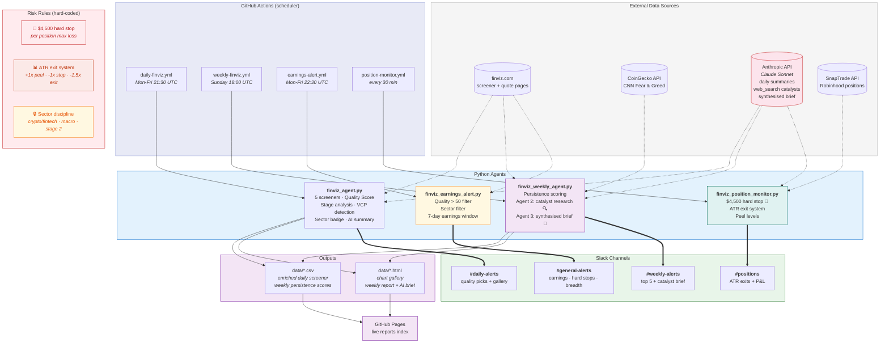

# Finviz Screener Agent — System Documentation

**Last updated:** 2026-03-21  
**Repo:** https://github.com/AnanthSrinivasan/finviz-screener-agent  
**Live reports:** https://ananthsrinivasan.github.io/finviz-screener-agent/

---

## 1. What This System Is

An automated trading intelligence system built around Anantha's 2025 trading DNA.

Not a black-box signal generator. The system surfaces, scores, and ranks setups that match a **proven edge** — crypto/fintech + macro commodities + Stage 2 momentum — and gets out of the way for the human decision.

**2025 performance that defines the edge:**
- 77% win rate on $1.2M traded, net +$54K
- 44% of profit from crypto/fintech (COIN +$13K, HOOD +$7K, SOFI +$2K)
- 30% from macro commodities (GLD +$8K, SLV +$8K before Feb 2026 loss)
- 17% from Stage 2 momentum (PLTR, IONQ, PL)
- Every single loss came from straying outside these three sectors

**The one rule that would have changed everything:**  
Stay in your sectors. The discipline gap costs ~$9K/year, not skills.

---

## 2. Architecture Diagram



---

## 3. Components

### 3.1 Daily Screener Agent — `finviz_agent.py`

**Schedule:** 21:30 UTC Mon-Fri (23:30 CET)  
**Slack:** `#daily-alerts` via `SLACK_WEBHOOK_DAILY`

**Flow:**
1. Hits 5 Finviz screener URLs, aggregates all tickers
2. Fetches snapshot metrics (ATR%, EPS, SMA distances, Rel Volume, 52w high distance)
3. Computes Weinstein Stage Analysis
4. Computes Minervini VCP detection
5. Computes Quality Score
6. Generates sectioned chart gallery HTML
7. Calls Claude API for AI analyst summary
8. Re-saves enriched CSV (with ATR%, Quality Score) so earnings alert reads it correctly
9. Fires Slack to `#daily-alerts`

**5 Screeners:**

| Name | What it catches |
|------|----------------|
| 10% Change | Gap/surge moves — EP candidates |
| Growth | EPS 20%+, Sales 20%+, above all MAs |
| IPO | Mid-cap+, listed within 3 years, above 20-day |
| 52 Week High | Making new highs — price leadership |
| Week 20%+ Gain | Significant weekly moves — momentum |

**Quality Score components:**
- Market cap (0–30 pts) — institutional grade filter
- Relative volume (0–25 pts) — conviction
- EPS Y/Y TTM (0–20 pts) — fundamental backing
- Multi-screener appearances (0–15 pts) — confirmation
- Stage 2 bonus (+25) / Stage 3 penalty (−25) / Stage 4 penalty (−40)
- VCP bonus (+15)
- Distance from 52w high (0–10 pts)

**Stage 2 criteria (fixed TAL-type false positives):**
- Price above SMA20, SMA50, SMA200
- SMA20 ≥ SMA50 (MAs properly stacked)
- Relative Volume ≥ 1.0 (not a sleepy drift)
- Distance from 52w high ≥ −25% (not still deep in base)

**Sector discipline badge:**  
Tickers outside core sectors get `⚠️ Outside Edge` and drop to Watch List.

---

### 3.2 Weekly Review Agent — `finviz_weekly_agent.py`

**Schedule:** 18:00 UTC Sunday  
**Slack:** `#weekly-alerts` via `SLACK_WEBHOOK_WEEKLY`

**Unified Signal Score:**

```
Signal Score = Base Persistence Score + Signal Bonuses

Base Score = (days_seen / total_days) × 100
           + (screener_diversity × 10)
           + 20 if multi-screener same day

Signal Bonuses:
  +30  EP  — gap/surge + 52w high + multi-screen same day
  +20  3+ screeners same day
  +15  IPO screener (lifecycle play)
  +10  52w high alone
```

EP/IPO names compete in the same ranking as persistence leaders. A 3/7 day EP with score 123 ranks above a passive 7/7 single-screener name at 110. Badges explain *why* a name ranks where it does.

**EP criteria (Stockbee/Qullamaggie):**
- Gap/surge screener fired: `10% Change` OR `Week 20%+ Gain`
- `52 Week High` also fired (real breakout, not dead-cat)
- `max_appearances ≥ 2` on same day

All three required. A single `10% Change` without a new high is not an EP.

**Agent 2 — Catalyst Research (built):**
After persistence scores are computed, the top 5 tickers are sent to Claude API with `web_search` tool enabled. Each call finds real-world catalysts (earnings beats, analyst upgrades, sector tailwinds) explaining why the ticker appeared in screeners. Results stored as `{ticker: summary}`.

**Agent 3 — Synthesiser (built):**
Takes Agent 2 research + macro data + Fear & Greed + crypto data and generates the weekly AI brief. The prompt instructs Claude to explain *why* each ticker ranks where it does using catalyst context, not just screener data.

**Report structure:**
1. Crypto snapshot (BTC, ETH)
2. Fear & Greed
3. Weekly AI intelligence brief (catalyst-informed via Agent 2 + 3)
4. Top 5 this week (focus cards with weekly charts)
5. Macro snapshot (colour-coded ▲▼)
6. Recurring names leaderboard (score > 50% of max, cap 30)

---

### 3.3 Winners Watchlist — `finviz_winners_watchlist.py` ✅ NEW

**Schedule:** 19:00 UTC Monday  
**Slack:** `#weekly-alerts` via `SLACK_WEBHOOK_WEEKLY`

Monitors 8 proven 2025 winners for re-entry setups. Also tracks 3 losers for character change.

**Winners watchlist:**

| Ticker | 2025 result | Edge |
|--------|------------|------|
| COIN | +$13,380 | crypto/fintech |
| HOOD | +$6,884 | crypto/fintech |
| SOFI | +$1,852 | crypto/fintech |
| PLTR | +$4,242 | stage2 momentum |
| IONQ | +$2,844 | stage2 momentum |
| GLD | +$8,214 | macro commodity |
| SLV | +$7,743 | macro commodity — Stage 2 only |
| PL | +$1,222 | ipo lifecycle |

**Three setup types:**
- `⚡ EP re-entry` — within 5% of 52w high + Stage 2 + RVol ≥ 1.2x
- `🟢 Stage 2 confirmed` — above all MAs, stacked, volume present
- `🔄 VCP forming` — ATR < 5%, RVol < 0.9x, above 20-day

**Lessons watchlist** (HIMS, RIVN, GME) — stage check only, not a trade signal.

**To add a new winner after a good trade:**
```python
"RDDT": {"reason": "2026 winner +$X, fintech", "edge": "crypto/fintech"},
```

---

### 3.4 Earnings Alert — `finviz_earnings_alert.py` ✅ UPDATED

**Schedule:** 22:30 UTC Mon-Fri (1 hour after screener)  
**Slack:** `#general-alerts` via `SLACK_WEBHOOK_ALERTS`

**Quality filter (item 4):**
- Only tickers with Quality Score > 50
- Only core sectors: crypto/fintech, macro, Stage 2 tech, energy, IPO lifecycle
- Character change flag: `10% Change` + `52 Week High` same week = potential Stage 1→2 transition

Reads enriched CSV written by the daily screener. Scrapes Finviz quote pages for earnings dates. Fires if any qualifying ticker has earnings within 7 days.

---

### 3.5 Alerts Agent — `finviz_alerts_agent.py`

**Schedule:** 22:00 UTC Mon-Fri  
**Slack:** `#general-alerts` via `SLACK_WEBHOOK_ALERTS`

F&G extremes, NYSE/Nasdaq breadth, ATR compression, commodity breakouts. State persisted in `data/alerts_state.json`.

---

### 3.6 Position Monitor — `finviz_position_monitor.py` ✅ UPDATED

**Schedule:** Every 30 min during market hours  
**Slack:** `#positions` via `SLACK_WEBHOOK_POSITIONS`

**Hard stop (item 3) — `MAX_POSITION_LOSS = -4500`:**

Fires 🚨 before any ATR calculation if a position is down more than $4,500 unrealised. Message says "Get out now. No exceptions." and references the SLV Feb 2026 loss explicitly.

```
SLV Feb 2026: held through Stage 3 distribution, lost $11K on one position.
$4,500 hard stop rule: no single position loses more than this. Period.
```

**Full alert hierarchy (priority order):**
1. 🚨 Hard stop — `pnl ≤ −$4,500`
2. 🔴 ATR exit — `atr_multiple_ma ≤ −1.5`
3. 🔴 Stop loss — `pnl% ≤ −dynamic_stop%`
4. 🟡 ATR warning — `atr_multiple_ma ≤ −1.0`
5. 🟡 Stop warning — approaching dynamic stop
6. 🟢 Peel signal — extended above MA (scales with ATR%)
7. 🔵 Peel warning — approaching peel level
8. ⚪ Healthy — no action

---

## 4. Slack Channel Routing

| Secret | Channel | Content | Failure notifies |
|--------|---------|---------|-----------------|
| `SLACK_WEBHOOK_DAILY` | `#daily-alerts` | Daily screener picks + gallery | `#general-alerts` |
| `SLACK_WEBHOOK_WEEKLY` | `#weekly-alerts` | Weekly review + winners watchlist | `#general-alerts` |
| `SLACK_WEBHOOK_ALERTS` | `#general-alerts` | Earnings alerts + hard stop fires + breadth alerts | `#general-alerts` |
| `SLACK_WEBHOOK_POSITIONS` | `#positions` | Live P&L, ATR exits, peel levels | `#general-alerts` |

`#general-alerts` also receives all workflow failure notifications — single place to check if anything is broken.

---

## 5. Sector Discipline

**Core edge sectors (where all 2025 profit came from):**
- Crypto / Fintech — COIN, HOOD, SOFI, PLTR, IONQ, RDDT
- Macro Commodities — GLD, SLV (Stage 2 only, hard stop mandatory)
- Stage 2 Momentum Tech — semiconductors, AI infrastructure, networking
- Energy — when XLE has macro tailwind
- IPO Lifecycle — mid-cap+, recently public, catalyst-driven

**Outside edge (where every 2025 loss came from):**
- Healthcare / Biotech (HIMS, CGON — unless IPO lifecycle with hard stop)
- EV / Automotive (RIVN)
- Meme stocks (GME)
- Macro crowded trades with blurry thesis (MSTR)
- Small-cap industrials without catalyst

---

## 6. Data Storage

**Flat files only — no database needed.**

```
data/
  finviz_screeners_YYYY-MM-DD.csv          # enriched daily (ATR%, Quality Score, Stage, VCP)
  finviz_screeners_YYYY-MM-DD.html         # plain HTML table
  finviz_chart_grid_YYYY-MM-DD.html        # chart gallery
  finviz_weekly_YYYY-MM-DD.html            # weekly report
  finviz_weekly_persistence_YYYY-MM-DD.csv # weekly signal scores
  alerts_state.json                        # breadth/F&G alert state
  positions_YYYY-MM-DD.json                # position snapshots
```

Volume is ~100–200 tickers/day. GitHub Actions reads/writes CSV natively. Reports are static HTML on GitHub Pages. No server, no cost, fully auditable via git history.

**When a database would be needed:**
- Querying "which tickers appeared 10+ times over 6 months" across weekly CSVs
- Automated order execution audit trail
- Multiple concurrent writers

Not needed yet. Revisit if automated execution is added.

---

## 7. Secrets Reference

| Secret | Used by |
|--------|---------|
| `SLACK_WEBHOOK_DAILY` | daily-finviz.yml |
| `SLACK_WEBHOOK_WEEKLY` | weekly-finviz.yml, winners-watchlist.yml |
| `SLACK_WEBHOOK_ALERTS` | earnings-alert.yml, alerts-finviz.yml, all failure hooks |
| `SLACK_WEBHOOK_POSITIONS` | position-monitor.yml |
| `ANTHROPIC_API_KEY` | finviz_agent.py, finviz_weekly_agent.py, finviz_position_monitor.py |
| `PAGES_BASE_URL` | all agents (gallery links in Slack) |
| `SNAPTRADE_CLIENT_ID` | finviz_position_monitor.py |
| `SNAPTRADE_CONSUMER_KEY` | finviz_position_monitor.py |
| `SNAPTRADE_USER_ID` | finviz_position_monitor.py |
| `SNAPTRADE_USER_SECRET` | finviz_position_monitor.py |

---

## 8. Risk Rules (Hard-Coded)

| Rule | Value | Enforced in |
|------|-------|------------|
| Max single position loss | $4,500 | `finviz_position_monitor.py` |
| ATR peel level | +scaled by ATR% | Position monitor |
| ATR full exit | −1.5× ATR multiple from MA | Position monitor |
| ATR stop warning | −1.0× ATR multiple from MA | Position monitor |
| Sector discipline | Core sectors only | Gallery badge + AI brief |
| ER alert quality floor | Quality Score > 50 | Earnings alert filter |
| ER alert sector filter | Core sectors only | Earnings alert filter |
| Earnings window | 7 days | Earnings alert |
| Stage 2 rel vol minimum | 1.0× | `compute_stage()` in finviz_agent.py |
| Stage 2 distance from high | ≥ −25% | `compute_stage()` in finviz_agent.py |

---

## 9. Roadmap

| # | Item | Status |
|---|------|--------|
| 1 | Winners watchlist + re-entry detector | ✅ Built |
| 2 | Separate Slack channels (4 webhooks) | ✅ Built |
| 3 | Position monitor $4,500 hard stop | ✅ Built |
| 4 | Earnings alert quality filter | ✅ Built (Claude Code) |
| 5 | Sector discipline badge in daily gallery | ✅ Built (Claude Code) |
| 6 | Agent 2 — catalyst research per ticker | ✅ Built |
| 7 | Agent 3 — synthesiser weekly brief | ✅ Built |
| 8 | Automated order execution via SnapTrade | 🔲 Deferred — guardrails discussion first |
| 9 | Multi-month trend analysis (SQLite) | 🔲 Only if needed |

---

## 10. Agent 2 + 3 Implementation (completed 2026-03-21)

### Agent 2 — Catalyst Research ✅

**Location:** `finviz_weekly_agent.py` → `research_catalysts()`

After persistence scores are built, takes the top 5 tickers and for each calls the Claude API (`claude-sonnet-4-6`) with `web_search_20250305` tool enabled (max 3 searches per ticker).

**Prompt per ticker:**
```
Research {ticker} ({sector} / {industry}) for a momentum trader weekly review.
[Signal context injected: EP, IPO, MULTI, HIGH badges if present]
Find: recent earnings beats or misses, analyst upgrades/downgrades,
sector tailwinds, any catalyst in the past 2 weeks that explains
why this stock appeared in momentum screeners all week.
Be specific. 3-4 sentences max. No fluff.
```

Returns `{ticker: research_summary}`. Handles 429s with exponential backoff.

### Agent 3 — Synthesiser ✅

**Location:** `finviz_weekly_agent.py` → `generate_weekly_ai_brief(research=None)`

Takes Agent 2's research dict + macro + Fear & Greed + crypto and injects catalyst context into the prompt. The AI brief now explains *why* tickers rank where they do using real-world catalysts, not just screener appearances.

Backward compatible — `research=None` default means existing callers work without changes.

**Key difference from pre-Agent 3 brief:**
- Before: "SNDK appeared 7/7 days in Growth screener"
- After: "SNDK appeared 7/7 days — Western Digital spin-off completed, institutions rotating in, storage cycle recovery thesis intact"

**Test coverage:** 6 tests (4 catalyst, 2 synthesiser) in `test_finviz_agent.py`.
